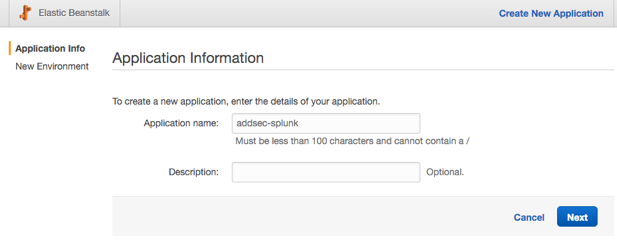
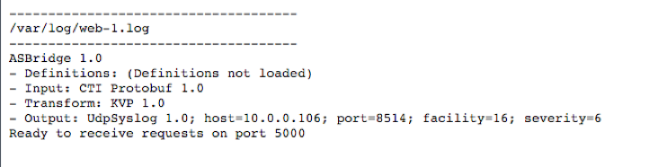

Overview
========

This document walks through the configuration and deployment of the AdditionSecurity Messaging Gateway using Amazon Web Services (AWS) Elastic Beanstalk.

Following the steps herein, you will have a cloud deployed auto-scaling & load balanced AdditionSecurity Messaging Gateway layer processing traffic. This setup is suitable to receive messages from the AdditionSecurity MobileAwareness SDK.

Requirements
============

You will need the following:

-   Downloaded AdditionSecurity Messaging Gateway software from the AdditionSecurity portal

-   An Amazon AWS account w/ administrative capability (this walk through uses the web-based AWS console for all operations)

-   An existing Amazon VPC with (at least) one public subnet with “Auto-assign Public IP” enabled

It is also assumed you have basic understanding of:

-   Amazon AWS configuration basics, including AWS regions, EC2 operation, security groups, VPCs, ELB, Elastic Beanstalk, etc.

VPC “Auto-assign Public IP”
---------------------------

Your VPC public subnet may not be configured to auto-assign a public IP to launched instances. You can check by opening the VPC services dashboard in the AWS console, selecting the target public subnet, and confirming the “Summary” tab for the VPC subnet indicates “Auto-assign public IP” is set to “yes”.


If it’s not set to “yes”, you can easily modify this by selecting the subnet then choosing “Modify Auto-assign Public IP” option from the “Subnet Actions” dropdown.


From there, check the “Enable auto-assign Public IP” box and click “Save”.


Deployment Topology
===================

The target topology for this quickstart:

-   The ElasticBeanstalk application in a VPC public subnet

-   A Java 8 ElasticBeanstalk application using an ELB load balancing/auto scaling configuration, running the AdditionSecurity Messaging Gateway software

Installing the AdditionSecurity Message Gateway
===============================================

This quickstart is going to deploy the AdditionSecurity Messaging Gateway using AWS ElasticBeanstalk.

Configuring the Message Gateway Deployment Bundle
-------------------------------------------------

ElasticBeanstalk deployments use an application bundle file, asgw\_eb.zip. The asgw\_eb.zip bundle file is a .zip file containing three required items:

-   asgw.jar - the AdditionSecurity Message Gateway application

-   Procfile - ElasticBeanstalk configuration directives

-   config.properties - configuration used for the Message Gateway

The asgw\_eb.zip file downloaded from the AdditionSecurity portal contains the asgw.jar and the Procfile. **You must add an appropriate config.properties file to the bundle before it’s ready to use.**

### Step 1: Edit the config.properties file

You can edit an existing config.properties file (e.g. the sample file included with the AdditionSecurity Message Gateway software distribution), or create a new empty file.

The particular configuration depends upon your desires for message transform format and eventual output. Please read the Messaging Gateway Operations Guide to determine a proper configuration.

The relevant configuration items particular to an Elastic Beanstalk deployment are:
```
port=5000

input=protobuf
```
Full details of these configuration values, and other available configuration values, are available in the AdditionSecurity Message Gateway Operations Guide available for download from the AdditionSecurity customer portal.

### Step 2: Add the config.properties file to the bundle .zip

Now add the updated config.properties file to the asgw\_eb.zip file.

#### Mac OSX & Linux

Run the following command:
```
zip asgw\_eb.zip config.properties
```
It should look like:
```
demo addsec\$ zip asgw\_eb.zip config.properties

adding: config.properties (deflated 35%)

demo addsec\$
```
#### Windows

TBD

Deploying via Elastic Beanstalk
-------------------------------

In the AWS ElasticBeanstalk Service console, open the Elastic Beanstalk service page.

### Step 1: Create New Application

Choose “Create New Application”. Enter in an application name and an optional description, then click “Next”.



You should be at the New Environment page.

### Step 2: Create a New Environment

Choose “Create Web Server” to create a web server environment


On the Environment Type page, enter the following options:

-   Predefined Configuration: Java

    -   NOTE: after selecting Java, confirm the wizard states it will create an environment running Java 8 on 64-bit Amazon Linux. Java 8 is required; older Java 7 instances will not work

-   Environment type: load balancing, auto-scaling


Click “Next”

On the Application Version page:

-   Source: select “Upload your Own”, and choose the asgw\_eb.zip file that includes your config.properties

-   Deployment Limits: leave as default


Click “Next”

On the Environment Information page:

-   Environment name: choose a unique identifying name

-   Environment URL: should automatically match your environment name

-   Description: optionally fill in a description


Click “Next”

On the Additional Resources page:

-   Leave the “Create an RDS DB Instance” box unchecked

-   Check the “Create this environment inside a VPC” box


Click “Next”

On the Configuration Details page:

-   Instance type: select your instance type

-   EC2 key pair: select an appropriate keypair

-   Email address: enter in an email address to get notices regarding the environment

-   Application health check URL: enter “/”

-   The remaining items can be left as default, or adjusted


Click “Next”

On the Environment Tags page:

-   Optionally enter any key/value pairs you wish to identify the environment


Click “Next”

On the VPC Configuration page:

-   VPC: select the same VPC as the prior deployed Splunk instance

-   Check the “ELB” and “EC2” checkboxes in the same subnet/availability zone as the prior deployed Splunk instance

-   Leave the VPC security group value unchanged

-   ELB Visibility should be left as “External”


Click “Next”

On the Permissions page:

-   Leave as default


Click “Next”

On the Review page:

-   Review the selected options from the prior inputs

Click “Launch”

You will now see the Elastic Beanstalk dashboard and status update of launching your environment and application. This can take a few minutes.


Once the launching is done, you should see a positive health indicator for your environment.


Note the URL listed next to the Environment ID -- this is the URL hostname to use when configuring AdditionSecurity Mobile Awareness SDK configurations.

Logging & Troubleshooting
-------------------------

The Messaging Gateway outputs initial startup and runtime error information to the standard output. In Elastic Beanstalk, this output is saved in /var/log/web-1.log, which is viewable via the Logs capability in the Elastic Beanstalk console.

In the Elastic Beanstalk console, select “Logs”


In the “Request Logs” dropdown, choose “Last 100 Lines” or “Full Logs”


Once the request is processed, you will have a log file download link



Clicking the download link and viewing the results, look for the “/var/log/web-1.log” section:


Optional: Enable SSL in Elastic Beanstalk
-----------------------------------------

Currently the Messaging Gateway is listening on HTTP. For security purposes, it should be changed to HTTPS.

### Requirements

You must procure an appropriate SSL certificate for use and upload it to AWS. The certificate can be self-generated, commercially issued, provided by AWS Certificate Manager, etc.

This quickstart does not cover sourcing a valid SSL certificate. For reference, please see the “Configuring HTTPS for your Elastic Beanstalk Environment” guide at:

[*http://docs.aws.amazon.com/elasticbeanstalk/latest/dg/configuring-https.html*]

### Enabling SSL in your Environment

Once your SSL certificate is populated in AWS IAM, configuring SSL is straight forward.

In the environment dashboard page, select “Configuration”. Then click the edit/”gear” icon on the Load Balancing/Network Tier box.


Make the following changes:

-   Listener port: change to “OFF”

-   Secure listener port: change to “443”

-   SSL certificate ID: select the SSL certificate to use


Click “Apply”.

Your environment will be updated to the new configuration. Once done, the messaging gateway will be available via HTTPS port 443 and no longer available via HTTP port 80.

Configuring Mobile Awareness SDK
================================

The Mobile Awareness SDK configuration generator optionally requires a URL to use as a remote messaging gateway. You will use the hostname previously listed in the Elastic Beanstalk console.

For HTTP (non-SSL) configurations
---------------------------------

The URL format is:

http://(elastic beanstalk hostname)/v1/msg

For example, if your Elastic Beanstalk URL is “addsecgw1.us-west-2.elasticbeanstalk.com”, then your messaging URL for the Mobile Awareness SDK configuration would be:

[*http://addsecgw1.us-west-2.elasticbeanstalk.com*]

For HTTPS configurations
------------------------

The URL format is:

https://(elastic beanstalk hostname)/v1/msg

For example, if your Elastic Beanstalk URL is “addsecgw1.us-west-2.elasticbeanstalk.com”, then your messaging URL for the Mobile Awareness SDK configuration would be:

[*https://addsecgw1.us-west-2.elasticbeanstalk.com*][*http://addsecgw1.us-west-2.elasticbeanstalk.com*]

In addition, the configuration generator can retrieve and recommend the appropriate HPKP/SSL pin information from the certificate in use in your Elastic Beanstalk environment.

  [*http://docs.aws.amazon.com/elasticbeanstalk/latest/dg/configuring-https.html*]: http://docs.aws.amazon.com/elasticbeanstalk/latest/dg/configuring-https.html
  [*http://addsecgw1.us-west-2.elasticbeanstalk.com*]: http://addsecgw1.us-west-2.elasticbeanstalk.com
