Overview
========

This document walks through the configuration and deployment of the AWS Messaging Gateway using Amazon Web Services (AWS), to forward traffic to a Splunk Lite installation also hosted in AWS.

Following the steps herein, you will have a cloud deployed auto-scaling & load balanced AdditionSecurity Messaging Gateway layer forwarding traffic to a Splunk Lite instance for searching and reporting. This setup is suitable to receive messages from the AdditionSecurity MobileAwareness SDK.

NOTE: Splunk Lite is free from the marketplace; Amazon charges will apply for all utilized AWS services

Contents
========

> [*Overview*]
>
> [*Contents*]
>
> [*Requirements*]
>
&nbsp;&nbsp;&nbsp;&nbsp;> [*VPC “Auto-assign Public IP”*]
>
> [*Deployment Topology*]
>
> [*Installing Splunk from AWS Marketplace*]
>
&nbsp;&nbsp;&nbsp;&nbsp;> [*Vendor Reference Documentation*]
>
&nbsp;&nbsp;&nbsp;&nbsp;> [*Deploying Splunk Light from the Marketplace*]
>
&nbsp;&nbsp;&nbsp;&nbsp;> [*Configuring the Splunk Lite Instance*]
>
&nbsp;&nbsp;&nbsp;&nbsp;&nbsp;&nbsp;&nbsp;&nbsp;> [*Step 1: Retrieve the instance ID, public IP, and private IP*]
>
&nbsp;&nbsp;&nbsp;&nbsp;&nbsp;&nbsp;&nbsp;&nbsp;> [*Step 2: Sign into the Instance and change your Splunk password*]
>
&nbsp;&nbsp;&nbsp;&nbsp;&nbsp;&nbsp;&nbsp;&nbsp;> [*Step 3: Add UDP Syslog Receiver*]
>
&nbsp;&nbsp;&nbsp;&nbsp;&nbsp;&nbsp;&nbsp;&nbsp;> [*Step 4: Adjusting the Splunk Instance Security Group*]
>
&nbsp;&nbsp;&nbsp;&nbsp;> [*Enabling HTTPS access to Splunk*]
>
> [*Installing the AdditionSecurity Message Gateway*]
>
&nbsp;&nbsp;&nbsp;&nbsp;> [*Configuring the Message Gateway Deployment Bundle*]
>
&nbsp;&nbsp;&nbsp;&nbsp;&nbsp;&nbsp;&nbsp;&nbsp;> [*Step 1: Edit the config.properties file*]
>
&nbsp;&nbsp;&nbsp;&nbsp;&nbsp;&nbsp;&nbsp;&nbsp;> [*Step 2: Add the config.properties file to the bundle .zip*]
>
&nbsp;&nbsp;&nbsp;&nbsp;&nbsp;&nbsp;&nbsp;&nbsp;&nbsp;&nbsp;&nbsp;&nbsp;> [*Mac OSX & Linux*]
>
&nbsp;&nbsp;&nbsp;&nbsp;&nbsp;&nbsp;&nbsp;&nbsp;&nbsp;&nbsp;&nbsp;&nbsp;> [*Windows*]
>
&nbsp;&nbsp;&nbsp;&nbsp;> [*Deploying via Elastic Beanstalk*]
>
&nbsp;&nbsp;&nbsp;&nbsp;&nbsp;&nbsp;&nbsp;&nbsp;> [*Step 1: Create New Application*]
>
&nbsp;&nbsp;&nbsp;&nbsp;&nbsp;&nbsp;&nbsp;&nbsp;> [*Step 2: Create a New Environment*]
>
&nbsp;&nbsp;&nbsp;&nbsp;> [*Logging & Troubleshooting*]
>
&nbsp;&nbsp;&nbsp;&nbsp;> [*Optional: Enable SSL in Elastic Beanstalk*]
>
&nbsp;&nbsp;&nbsp;&nbsp;&nbsp;&nbsp;&nbsp;&nbsp;> [*Requirements*][1]
>
&nbsp;&nbsp;&nbsp;&nbsp;&nbsp;&nbsp;&nbsp;&nbsp;> [*Enabling SSL in your Environment*]
>
> [*Configuring Mobile Awareness SDK*]
>
&nbsp;&nbsp;&nbsp;&nbsp;> [*For HTTP (non-SSL) configurations*]
>
&nbsp;&nbsp;&nbsp;&nbsp;> [*For HTTPS configurations*]

Requirements
============

You will need the following:

-   Downloaded AdditionSecurity Messaging Gateway software from the AdditionSecurity customer portal

-   An Amazon AWS account w/ administrative capability (this walk through uses the web-based AWS console for all operations)

-   An existing Amazon VPC with (at least) one public subnet with “Auto-assign Public IP” enabled

It is also assumed you have basic understanding of:

-   Amazon AWS configuration basics, including AWS regions, EC2 operation, security groups, VPCs, ELB, Elastic Beanstalk, etc.

-   Splunk/Splunk Lite usage (see Splunk vendor documentation for tutorials, etc.)

VPC “Auto-assign Public IP”
---------------------------

Your VPC public subnet may not be configured to auto-assign a public IP to launched instances. You can check by opening the VPC services dashboard in the AWS console, selecting the target public subnet, and confirming the “Summary” tab for the VPC subnet indicates “Auto-assign public IP” is set to “yes”.

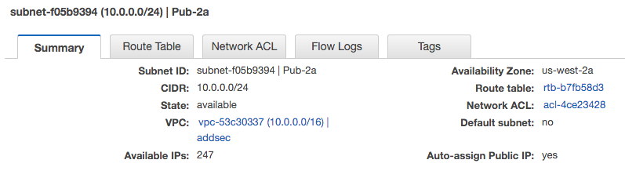

If it’s not set to “yes”, you can easily modify this by selecting the subnet then choosing “Modify Auto-assign Public IP” option from the “Subnet Actions” dropdown.

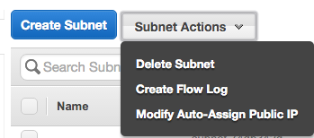

From there, check the “Enable auto-assign Public IP” box and click “Save”.

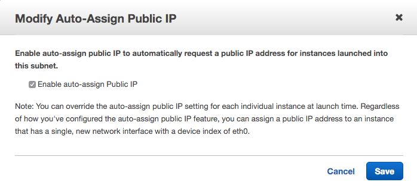

Deployment Topology
===================

The target topology for this quickstart:

-   The ElasticBeanstalk application and Splunk EC2 instance, co-located in the same VPC public subnet

-   A Java 8 ElasticBeanstalk application using an ELB load balancing/auto scaling configuration, running the AdditionSecurity Messaging Gateway software

-   An EC2 instance running Splunk Lite

-   The Messaging Gateway software will send UDP traffic to the Splunk Lite instance on port 8514

-   Optionally: an ELB to provide HTTPS in front of the Splunk Lite instance

Installing Splunk from AWS Marketplace
======================================

This quickstart will deploy a Splunk Light AMI instance from the AWS Marketplace.

Vendor Reference Documentation
------------------------------

[*http://docs.splunk.com/Documentation/SplunkLight/6.3.0/Installation/AbouttheSplunkAMI*]

[*https://www.splunk.com/content/dam/splunk2/pdfs/technical-briefs/deploying-splunk-enterprise-on-amazon-web-services-technical-brief.pdf*]

Deploying Splunk Light from the Marketplace
-------------------------------------------

Visit the AWS Marketplace for Splunk Light:

https://aws.amazon.com/marketplace/pp/B015ZG2196/ref=dtl\_recsim\_B00PUXWXNE\_B015ZG2196\_2

NOTE: the marketplace URLs are subject to change from time to time; if the above URL does not work, then search the AWS Marketplace for “Splunk Light”

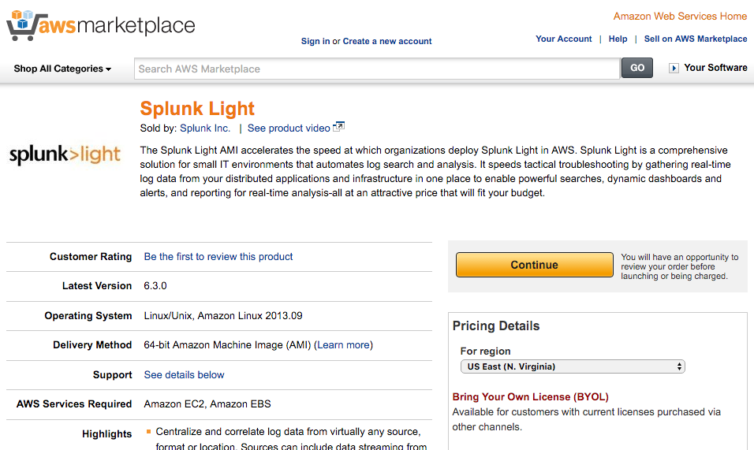

Click the “Continue” button to go to the launch configuration page.

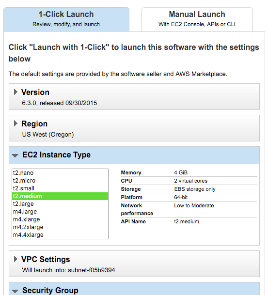

Under the “1-Click Launch” tab:

1.  Region: Select your AWS region that contains your target VPC

2.  EC2 Instance Type: Select your EC2 Instance type

3.  VPC Settings: Select your VPC and VPC subnet

4.  Security Group: Leave “AutogenByAWSMP” default

5.  Key Pair: Choose the appropriate EC2 instance key pair

Recommended to leave the suggested seller recommended security group options, they will be adjusted separately.

Click “Accept Software Terms & Launch with 1-Click”

Configuring the Splunk Lite Instance
------------------------------------

The vendor configuration instructions state:

Get started with Splunk Light:

\* In your EC2 Management Console, find your instance running Splunk Light.

\* Copy the public IP.

\* Paste the public IP into a new browser tab (do not hit enter yet).

\* Append :8000 to the end of the IP.

\* Hit enter.

\* Log into Splunk Light with the following credentials:

\*\* username: admin

\*\* password: &lt;the instance id of the instance just created&gt;

### Step 1: Retrieve the instance ID, public IP, and private IP

Using the AWS EC2 Service console, note the instance ID and the public IP address of the deployed Splunk Lite instance. These are needed for accessing and configuring the instance.

Please also note the private IP address of the instance; this will be used when configuring the AdditionSecurity Message Gateway.

### Step 2: Sign into the Instance and change your Splunk password

Using a web browser, you will need to visit the following URL:

*http://(instance\_public\_ip):8000/*

Substitute the public IP of the instance (from Step 1) in the URL. You should be greeted with a Splunk Login page.


Enter “admin” for username and your instance ID from Step 1 (e.g. “i-823462”) as the password. You will then be prompted to set a new admin password.

You should arrive at the Splunk Lite main dashboard.

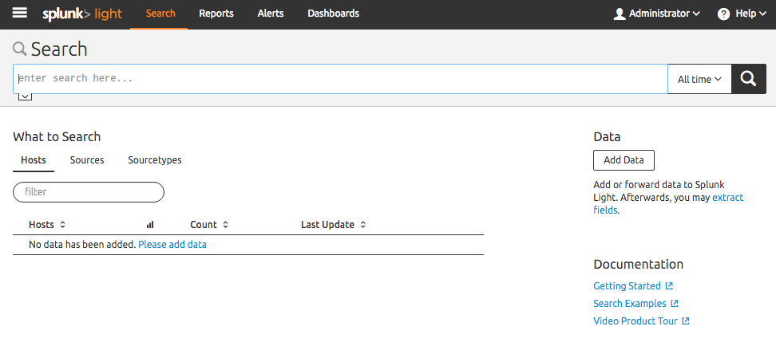

### Step 3: Add UDP Syslog Receiver

We are going to configure Splunk to receive syslog messages on UDP port 8514.

At the main dashboard, click “Add Data” on the right column.

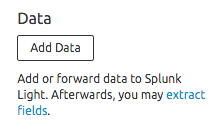

On the “Add Data” page, click the “Monitor” selection

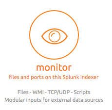

Select “TCP/UDP” on the left side

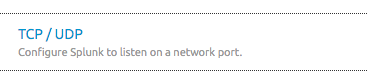

Enter in the following info:

-   Select UDP

-   Port: 8514

Click “Next” at the top


On the Input Settings page, enter in the following info:

-   Source type: Select

-   (Select Source Type dropdown): Operating System -&gt; syslog

    -   NOTE: you will have to scroll the Operating System submenu to see syslog option

-   Host: IP

-   Index: default

-   

Click “Review” at the top

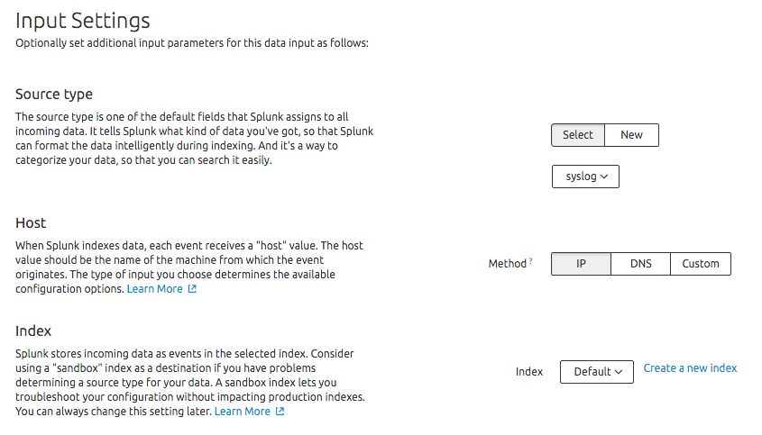

The review options should resemble the following screenshot:

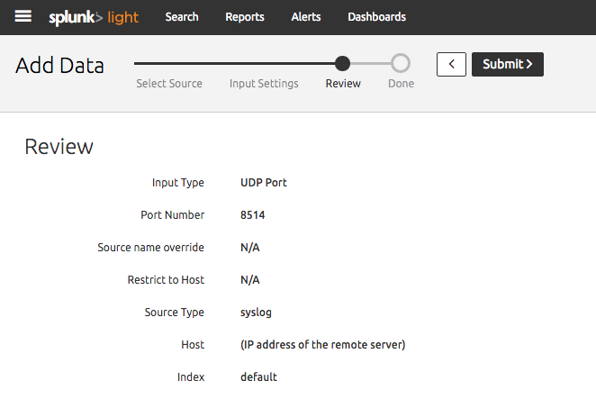

Click “Submit” at the top. You should see a confirmation page.

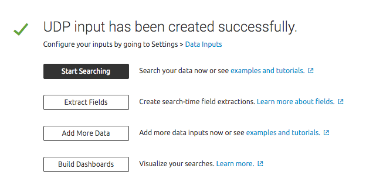

### Step 4: Adjusting the Splunk Instance Security Group

Since we just added a new incoming port (UDP 8514), we need to adjust the AWS EC2 Security Group for the Splunk instance to allow incoming traffic.

Using the AWS EC2 Service console, select “Security Groups” under “Network & Security”, then select the “Splunk Light-(version)-AutogenByAWSMP” security group.

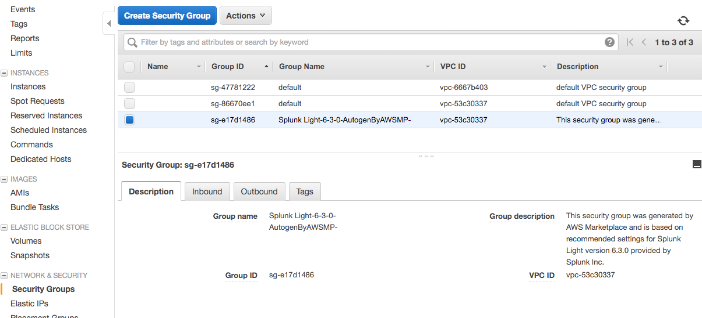

Click the “Inbound” tab, then “Edit”. Make the following changes:

-   Delete the TCP port 514 rule

-   Edit the UDP port 514 rule to change the port to 8514

-   Leave the TCP port 8000 and TCP port 22 rules

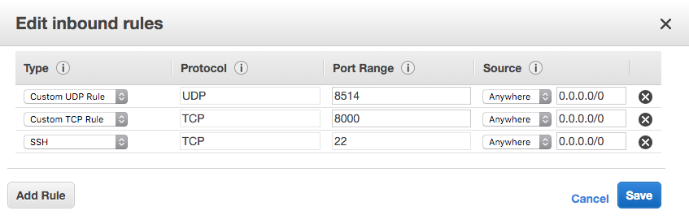

Click “Save”.

Enabling HTTPS access to Splunk
-------------------------------

The Splunk software uses HTTP by default. You can optionally (but recommended) enable HTTPS to keep your communication with the Splunk instance private. Use the following steps to enable HTTPS.

NOTE: while Splunk comes with built-in HTTPS support for evaluation use, it is not recommended by the vendor for production use since the included default certificate is shared derived from public data. For more information, see [*http://docs.splunk.com/Documentation/Splunk/6.1.4/Security/TurnonbasicencryptionwithSplunkWeb*]

Select the menu navigation icon in the top left corner.


Expand “System” and select “Server Settings”

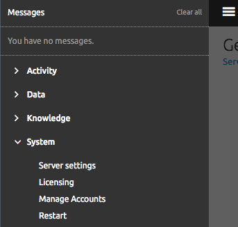

Select “General Settings”

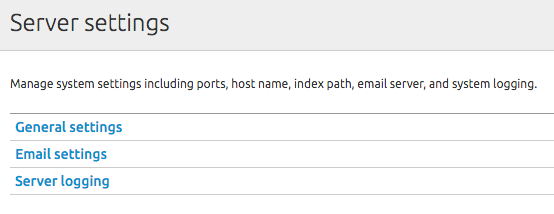

Under “Splunk Web”, select the “Yes” option under “Enable SSL (HTTPS) in Splunk Web?” Line

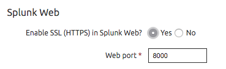

Click “Save”

A restart is now required. Click the menu navigation icon in the top left. There should be a “Click here to restart” message. Click to restart.

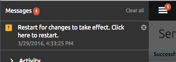

Confirm the restart.

After sufficient time to allow Splunk to restart, access the Splunk instance using an “https://” URL instead of the prior “http://” URL, e.g.:

*https://(instance\_public\_ip):8000/*

You may receive a certificate violation warning, since the Splunk generated certificate is not commercially issued by a Certificate Authority. Follow your web browser’s directions to accept the certificate and/or proceed anyway.

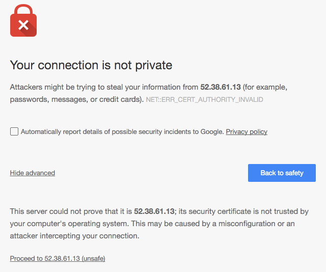

Congratulations, your Splunk Lite instance is ready for use!

Installing the AdditionSecurity Message Gateway
===============================================

This quickstart is going to deploy the AdditionSecurity Messaging Gateway using AWS ElasticBeanstalk. You will configure the Messaging Gateway to receive messages, transform them into key-value pairs (KVP), and forward the KVP messages to the Splunk system over UDP syslog on port 8514. The gateway will be deployed into the same VPC subnet as the running Splunk instance.

Configuring the Message Gateway Deployment Bundle
-------------------------------------------------

ElasticBeanstalk deployments use an application bundle file. The provided asgw\_eb.zip bundle file needs to contain three required items:

-   asgw.jar - the AdditionSecurity Message Gateway application

-   Procfile - ElasticBeanstalk configuration directives

-   config.properties - configuration used for the Message Gateway

The asgw\_eb.zip file downloaded from the AdditionSecurity portal contains the asgw.jar and the Procfile. **You must add an appropriate config.properties file to the bundle before it’s ready to use.**

### Step 1: Edit the config.properties file

You can edit an existing config.properties file (e.g. the sample file included with the AdditionSecurity Message Gateway software distribution), or create a new empty file.

Change the config.properties to use the following values:
```
port=5000

input=protobuf

transform=kvp

transform.systemId2\_string=true

transform.accountName2\_string=true

output=udpsyslog

output.syslog.host=(private IP of EC2 instance)

output.syslog.port=8514
```
NOTE: you must include the private IP address of your Splunk Lite instance (retrievable from the AWS EC2 Service console) for the value of output.syslog.host; e.g. output.syslog.host=10.0.0.42

Full details of these configuration values, and other available configuration values, are available in the AdditionSecurity Message Gateway Reference Guide available for download from the AdditionSecurity portal.

### Step 2: Add the config.properties file to the bundle .zip

Now add the updated config.properties file to the asgw\_eb.zip file.

#### Mac OSX & Linux

Run the following command:
```
zip asgw\_eb.zip config.properties
```
It should look like:
```
demo addsec\$ zip asgw\_eb.zip config.properties

adding: config.properties (deflated 35%)

demo addsec\$
```
#### Windows

TBD

Deploying via Elastic Beanstalk
-------------------------------

In the AWS ElasticBeanstalk Service console, open the Elastic Beanstalk service page.

### Step 1: Create New Application

Choose “Create New Application”. Enter in an application name and an optional description, then click “Next”.

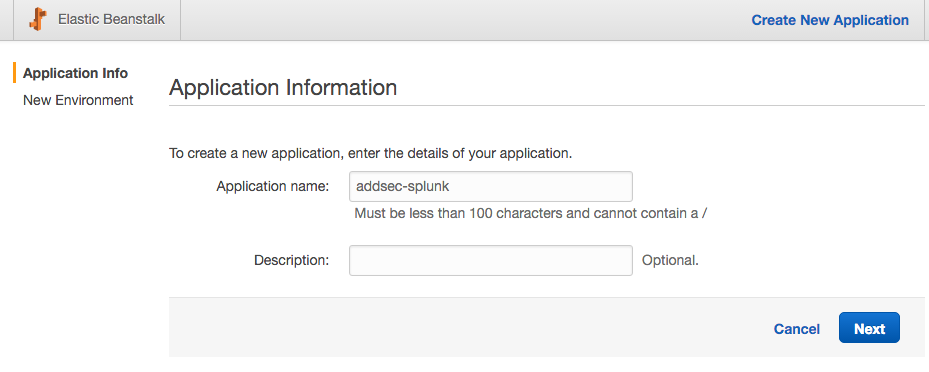

You should be at the New Environment page.

### Step 2: Create a New Environment

Choose “Create Web Server” to create a web server environment

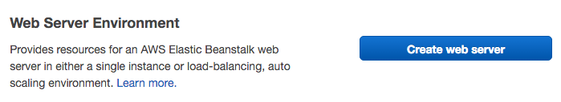

On the Environment Type page, enter the following options:

-   Predefined Configuration: Java

    -   NOTE: after selecting Java, confirm the wizard states it will create an environment running Java 8 on 64-bit Amazon Linux. Java 8 is required; older Java 7 instances will not work

-   Environment type: load balancing, auto-scaling

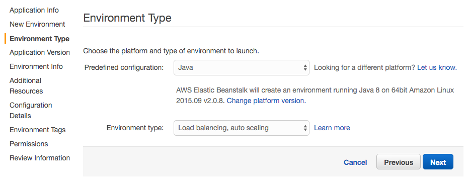

Click “Next”

On the Application Version page:

-   Source: select “Upload your Own”, and choose the asgw\_eb.zip file that includes your config.properties

-   Deployment Limits: leave as default

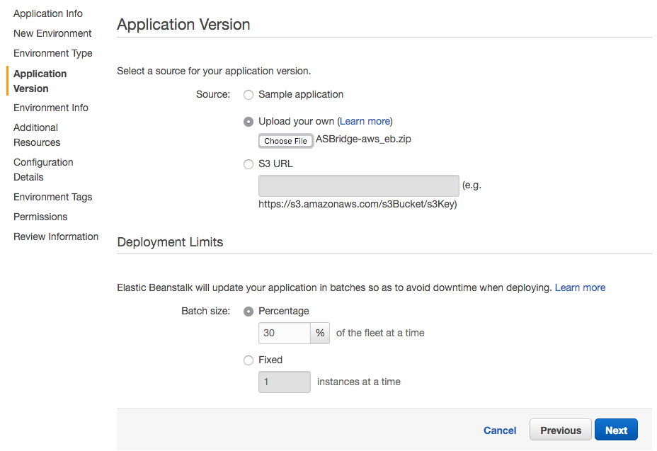

Click “Next”

On the Environment Information page:

-   Environment name: choose a unique identifying name

-   Environment URL: should automatically match your environment name

-   Description: optionally fill in a description

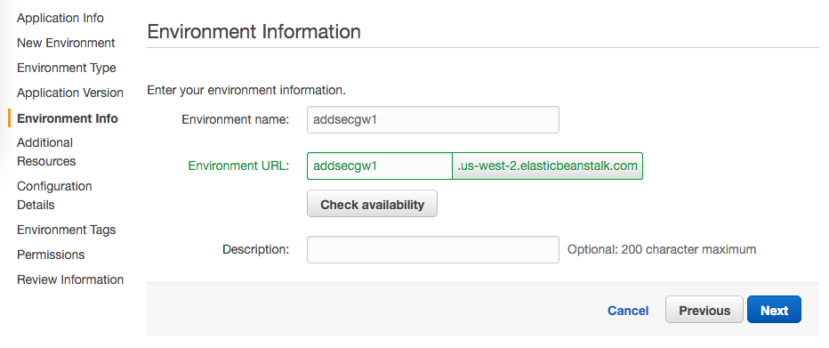

Click “Next”

On the Additional Resources page:

-   Leave the “Create an RDS DB Instance” box unchecked

-   Check the “Create this environment inside a VPC” box

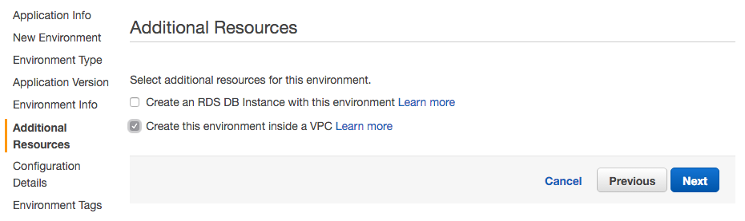

Click “Next”

On the Configuration Details page:

-   Instance type: select your instance type

-   EC2 key pair: select an appropriate keypair

-   Email address: enter in an email address to get notices regarding the environment

-   Application health check URL: enter “/”

-   The remaining items can be left as default, or adjusted

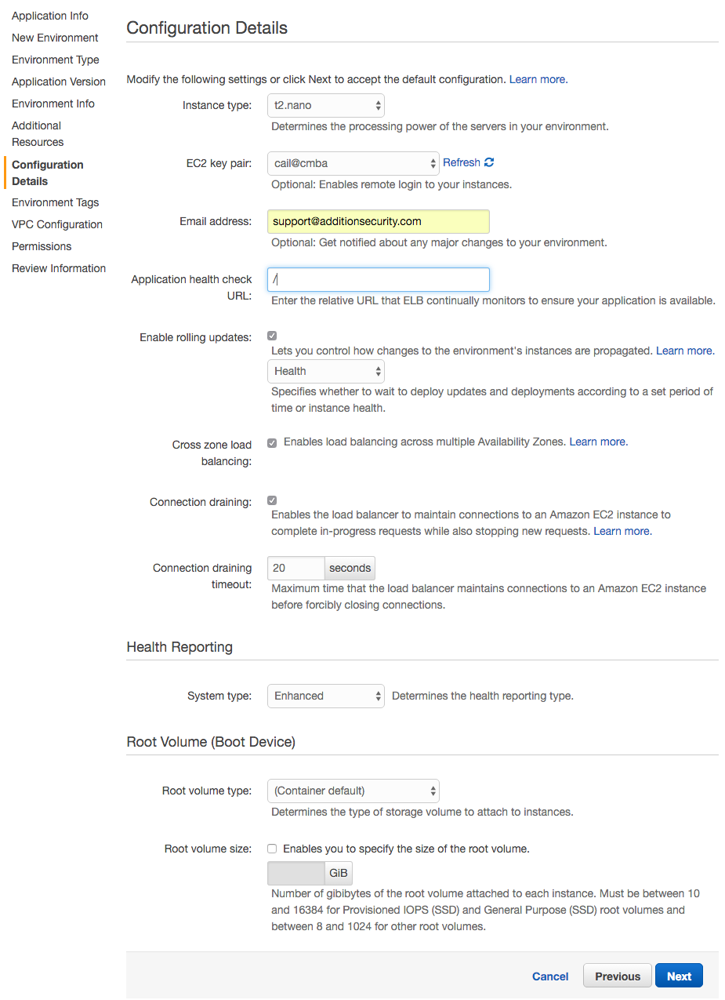

Click “Next”

On the Environment Tags page:

-   Optionally enter any key/value pairs you wish to identify the environment

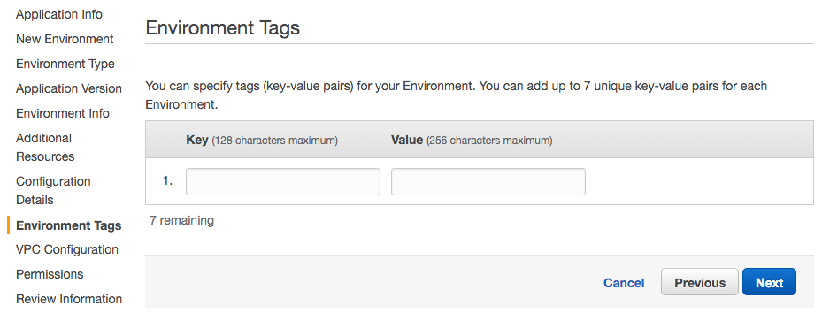

Click “Next”

On the VPC Configuration page:

-   VPC: select the same VPC as the prior deployed Splunk instance

-   Check the “ELB” and “EC2” checkboxes in the same subnet/availability zone as the prior deployed Splunk instance

-   Leave the VPC security group value unchanged

-   ELB Visibility should be left as “External”

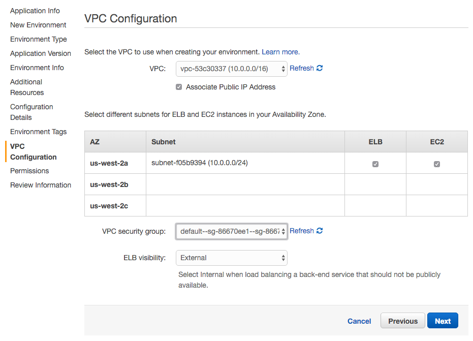

Click “Next”

On the Permissions page:

-   Leave as default

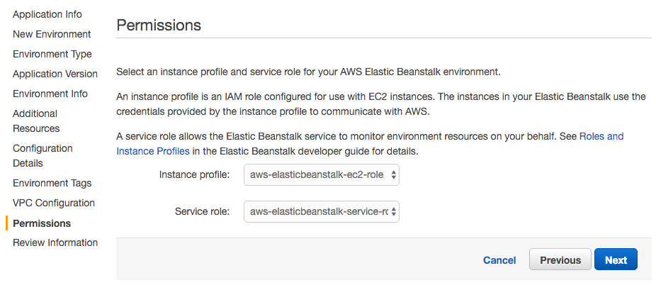

Click “Next”

On the Review page:

-   Review the selected options from the prior inputs

Click “Launch”

You will now see the Elastic Beanstalk dashboard and status update of launching your environment and application. This can take a few minutes.

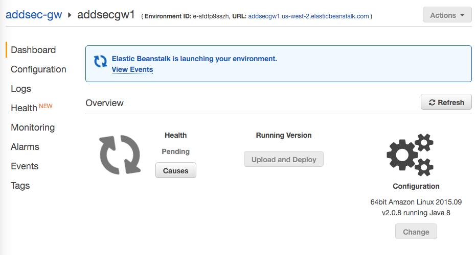

Once the launching is done, you should see a positive health indicator for your environment.

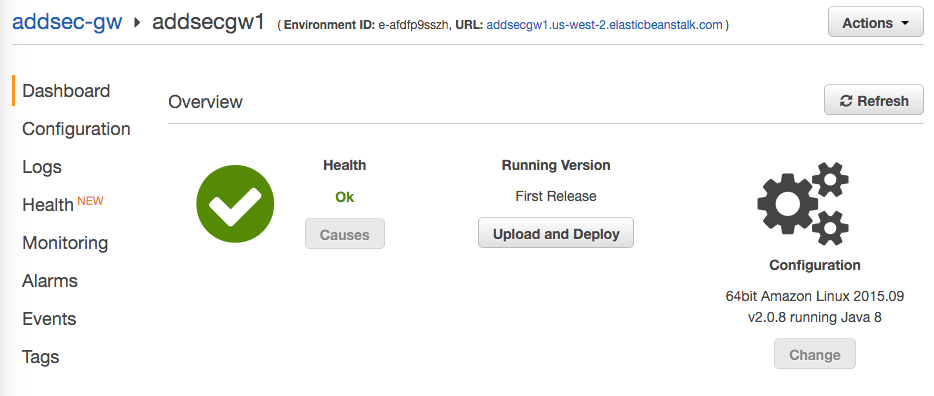

Note the URL listed next to the Environment ID -- this is the URL hostname to use when configuring AdditionSecurity Mobile Awareness SDK configurations.

Logging & Troubleshooting
-------------------------

The Messaging Gateway outputs initial startup and runtime error information to the standard output. In Elastic Beanstalk, this output is saved in /var/log/web-1.log, which is viewable via the Logs capability in the Elastic Beanstalk console.

In the Elastic Beanstalk console, select “Logs”

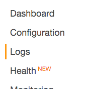

In the “Request Logs” dropdown, choose “Last 100 Lines” or “Full Logs”

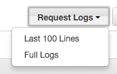

Once the request is processed, you will have a log file download link

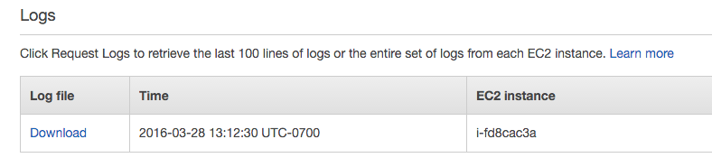

Clicking the download link and viewing the results, look for the “/var/log/web-1.log” section:

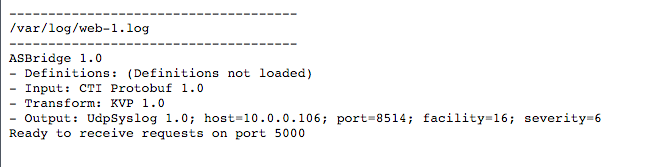

Optional: Enable SSL in Elastic Beanstalk
-----------------------------------------

Currently the Messaging Gateway is listening on HTTP. For security purposes, it should be changed to HTTPS.

### Requirements

You must procure an appropriate SSL certificate for use and upload it to AWS. The certificate can be self-generated, commercially issued, provided by AWS Certificate Manager, etc.

This quickstart does not cover sourcing a valid SSL certificate. For reference, please see the “Configuring HTTPS for your Elastic Beanstalk Environment” guide at:

[*http://docs.aws.amazon.com/elasticbeanstalk/latest/dg/configuring-https.html*]

### Enabling SSL in your Environment

Once your SSL certificate is populated in AWS IAM, configuring SSL is straight forward.

In the environment dashboard page, select “Configuration”. Then click the edit/”gear” icon on the Load Balancing/Network Tier box.

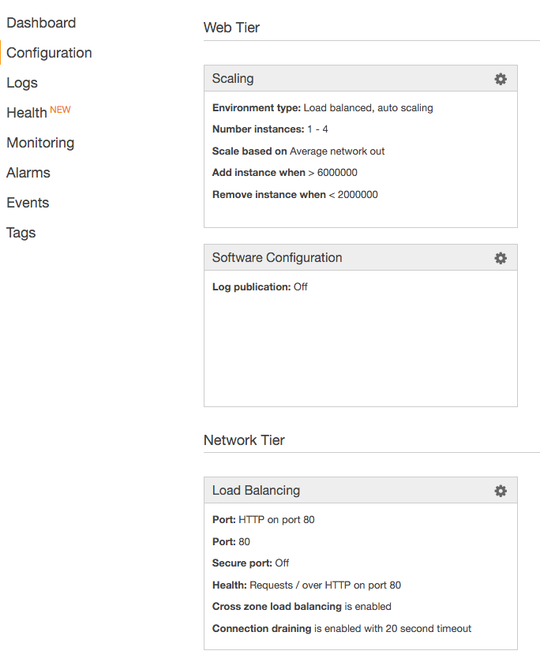

Make the following changes:

-   Listener port: change to “OFF”

-   Secure listener port: change to “443”

-   SSL certificate ID: select the SSL certificate to use

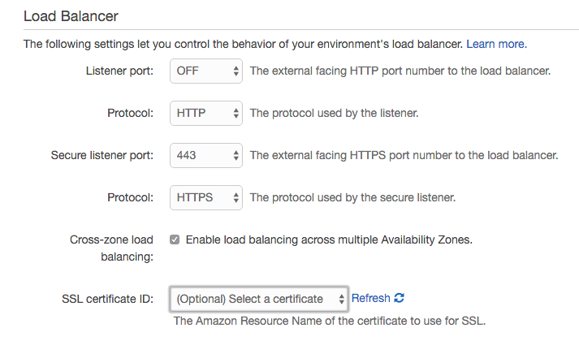

Click “Apply”.

Your environment will be updated to the new configuration. Once done, the messaging gateway will be available via HTTPS port 443 and no longer available via HTTP port 80.

Configuring Mobile Awareness SDK
================================

The Mobile Awareness SDK configuration wizard optionally requires a URL to use as a remote messaging gateway. You will use the hostname previously listed in the Elastic Beanstalk console.

For HTTP (non-SSL) configurations
---------------------------------

The URL format is:

http://(elastic beanstalk hostname)/v1/msg

For example, if your Elastic Beanstalk URL is “addsecgw1.us-west-2.elasticbeanstalk.com”, then your messaging URL for the Mobile Awareness SDK configuration would be:

[*http://addsecgw1.us-west-2.elasticbeanstalk.com*]

For HTTPS configurations
------------------------

The URL format is:

https://(elastic beanstalk hostname)/v1/msg

For example, if your Elastic Beanstalk URL is “addsecgw1.us-west-2.elasticbeanstalk.com”, then your messaging URL for the Mobile Awareness SDK configuration would be:

[*https://addsecgw1.us-west-2.elasticbeanstalk.com*][*http://addsecgw1.us-west-2.elasticbeanstalk.com*]

In addition, the configuration wizard will retrieve and recommend the appropriate HPKP/SSL pin information from the certificate in use in your environment.

  [*Overview*]: #overview
  [*Contents*]: #contents
  [*Requirements*]: #requirements
  [*VPC “Auto-assign Public IP”*]: #vpc-auto-assign-public-ip
  [*Deployment Topology*]: #deployment-topology
  [*Installing Splunk from AWS Marketplace*]: #installing-splunk-from-aws-marketplace
  [*Vendor Reference Documentation*]: #vendor-reference-documentation
  [*Deploying Splunk Light from the Marketplace*]: #deploying-splunk-light-from-the-marketplace
  [*Configuring the Splunk Lite Instance*]: #configuring-the-splunk-lite-instance
  [*Step 1: Retrieve the instance ID, public IP, and private IP*]: #step-1-retrieve-the-instance-id-public-ip-and-private-ip
  [*Step 2: Sign into the Instance and change your Splunk password*]: #step-2-sign-into-the-instance-and-change-your-splunk-password
  [*Step 3: Add UDP Syslog Receiver*]: #step-3-add-udp-syslog-receiver
  [*Step 4: Adjusting the Splunk Instance Security Group*]: #step-4-adjusting-the-splunk-instance-security-group
  [*Enabling HTTPS access to Splunk*]: #enabling-https-access-to-splunk
  [*Installing the AdditionSecurity Message Gateway*]: #installing-the-additionsecurity-message-gateway
  [*Configuring the Message Gateway Deployment Bundle*]: #configuring-the-message-gateway-deployment-bundle
  [*Step 1: Edit the config.properties file*]: #step-1-edit-the-config.properties-file
  [*Step 2: Add the config.properties file to the bundle .zip*]: #step-2-add-the-config.properties-file-to-the-bundle-.zip
  [*Mac OSX & Linux*]: #mac-osx-linux
  [*Windows*]: #windows
  [*Deploying via Elastic Beanstalk*]: #deploying-via-elastic-beanstalk
  [*Step 1: Create New Application*]: #step-1-create-new-application
  [*Step 2: Create a New Environment*]: #step-2-create-a-new-environment
  [*Logging & Troubleshooting*]: #logging-troubleshooting
  [*Optional: Enable SSL in Elastic Beanstalk*]: #optional-enable-ssl-in-elastic-beanstalk
  [1]: #requirements-1
  [*Enabling SSL in your Environment*]: #enabling-ssl-in-your-environment
  [*Configuring Mobile Awareness SDK*]: #configuring-mobile-awareness-sdk
  [*For HTTP (non-SSL) configurations*]: #for-http-non-ssl-configurations
  [*For HTTPS configurations*]: #for-https-configurations
  []: img/splunk-001.png.png{width="5.494792213473316in" height="1.5586187664041995in"}
  [2]: img/splunk-002.png.png{width="2.6321358267716537in" height="1.1614588801399826in"}
  [3]: img/splunk-003.png.png{width="4.734375546806649in" height="2.144553805774278in"}
  [*http://docs.splunk.com/Documentation/SplunkLight/6.3.0/Installation/AbouttheSplunkAMI*]: http://docs.splunk.com/Documentation/SplunkLight/6.3.0/Installation/AbouttheSplunkAMI
  [*https://www.splunk.com/content/dam/splunk2/pdfs/technical-briefs/deploying-splunk-enterprise-on-amazon-web-services-technical-brief.pdf*]: https://www.splunk.com/content/dam/splunk2/pdfs/technical-briefs/deploying-splunk-enterprise-on-amazon-web-services-technical-brief.pdf
  [4]: img/splunk-004.png.png{width="4.296875546806649in" height="2.568484251968504in"}
  [5]: img/splunk-005.png.png{width="1.9815583989501313in" height="2.1927088801399823in"}
  [6]: img/splunk-006.png.png{width="3.526042213473316in" height="1.734767060367454in"}
  [7]: img/splunk-0.png.png{width="5.439963910761155in" height="2.432292213473316in"}
  [8]: img/splunk-0.png.png{width="1.5306933508311462in" height="0.9114588801399826in"}
  [9]: img/splunk-0.png.png{width="1.0290474628171478in" height="1.015625546806649in"}
  [10]: img/splunk-0.png.png{width="3.8229166666666665in" height="0.875in"}
  [11]: img/splunk-0.png.png{width="3.612169728783902in" height="1.9739588801399826in"}
  [12]: img/splunk-0.png.png{width="3.50490157480315in" height="2.0052088801399823in"}
  [13]: img/splunk-0.png.png{width="4.241398731408574in" height="2.963542213473316in"}
  [14]: img/splunk-0.png.png{width="4.005208880139983in" height="2.1502318460192478in"}
  [15]: img/splunk-0.png.png{width="4.088542213473316in" height="1.8608103674540681in"}
  [16]: img/splunk-0.png.png{width="5.140625546806649in" height="1.6393985126859143in"}
  [*http://docs.splunk.com/Documentation/Splunk/6.1.4/Security/TurnonbasicencryptionwithSplunkWeb*]: http://docs.splunk.com/Documentation/Splunk/6.1.4/Security/TurnonbasicencryptionwithSplunkWeb
  [17]: img/splunk-0.png.png{width="0.8854166666666666in" height="0.4895833333333333in"}
  [18]: img/splunk-0.png.png{width="2.2960925196850392in" height="2.182292213473316in"}
  [19]: img/splunk-0.png.png{width="4.088542213473316in" height="1.5793285214348207in"}
  [20]: img/splunk-0.png.png{width="2.942339238845144in" height="0.9010422134733158in"}
  [21]: img/splunk-0.png.png{width="3.7083333333333335in" height="1.3125in"}
  [22]: img/splunk-0.png.png{width="4.026042213473316in" height="3.3550349956255467in"}
  [23]: img/splunk-0.png.png{width="4.111445756780403in" height="1.640625546806649in"}
  [24]: img/splunk-0.png.png{width="4.276042213473316in" height="0.7880522747156605in"}
  [25]: img/splunk-0.png.png{width="4.026042213473316in" height="1.567833552055993in"}
  [26]: img/splunk-0.png.png{width="4.0625in" height="2.7864588801399823in"}
  [27]: img/splunk-0.png.png{width="3.994792213473316in" height="1.6708989501312337in"}
  [28]: img/splunk-0.png.png{width="4.0581080489938754in" height="1.203125546806649in"}
  [29]: img/splunk-0.png.png{width="3.6694772528433948in" height="5.057292213473316in"}
  [30]: img/splunk-0.png.png{width="3.633966535433071in" height="1.3802088801399826in"}
  [31]: img/splunk-0.png.png{width="3.838542213473316in" height="2.768630796150481in"}
  [32]: img/splunk-0.png.png{width="3.744792213473316in" height="1.6555916447944008in"}
  [33]: img/splunk-0.png.png{width="4.569402887139107in" height="2.4531255468066493in"}
  [34]: img/splunk-0.png.png{width="4.444128390201225in" height="1.8802088801399826in"}
  [35]: img/splunk-0.png.png{width="1.2447922134733158in" height="1.2884689413823271in"}
  [36]: img/splunk-0.png.png{width="1.5033027121609799in" height="0.9531255468066492in"}
  [37]: img/splunk-0.png.png{width="4.886054243219598in" height="1.1510422134733158in"}
  [38]: img/splunk-0.png.png{width="4.880208880139983in" height="1.2435148731408574in"}
  [*http://docs.aws.amazon.com/elasticbeanstalk/latest/dg/configuring-https.html*]: http://docs.aws.amazon.com/elasticbeanstalk/latest/dg/configuring-https.html
  [39]: img/splunk-0.png.png{width="3.108222878390201in" height="3.8177088801399823in"}
  [40]: img/splunk-0.png.png{width="3.9830161854768154in" height="2.3489588801399823in"}
  [*http://addsecgw1.us-west-2.elasticbeanstalk.com*]: http://addsecgw1.us-west-2.elasticbeanstalk.com
