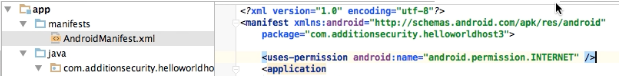
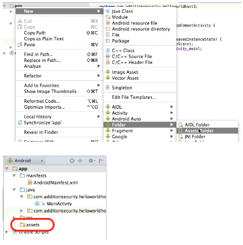
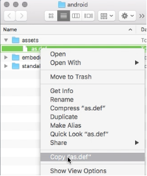
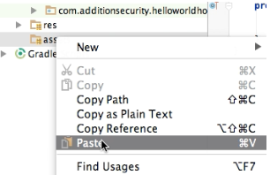
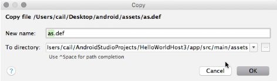
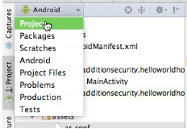
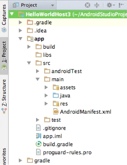
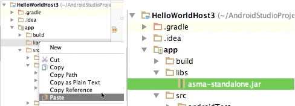
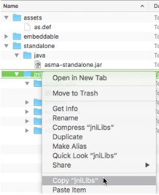
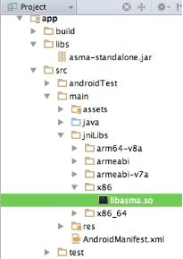

---
MobileAwareness SDK - Android Developer Guide
---

Associated product: MobileAwareness SDK for Android version 1.3

Overview
========

The MobileAwareness SDK for Android is integrated into Android applications during development.  Both standalone (no native code development necessary) and embeddable versions are available, along with Java libraries for JNI bridge classes.

Compatibility
=============

The MobileAwareness SDK runs on Android versions 4.0.x (API 14) and later.  The `Internet` permission is necessary in the application’s manifest.

<div class="alert alert-info">Android Wear, Android Auto, and Android TV are not supported by the MobileAwareness SDK</div>

The SDK includes support for armeabi, armeabi-v7a, arm64-v8a, x86, and x86_64 devices.  Please contact Addition Security customer support for MIPS support.


Cryptography
------------

The MobileAwareness SDK for Android provides various cryptographic variations
to meet security, regulation and export compliance requirements.

 | SDK Name | Cryptography Description | FIPS Certified |
 | -------- | ------------------------ | ______________ |
 | Standalone | Includes an internal copy of mbedTLS cryptography library; mbedTLS APIs are reusable by the application for other purposes<br/>Cryptography export required | No |


X86 Device Support & ARM Emulation
----------------------------------

Many X86-based Android devices can emulate and execute ARM binaries. Starting with version 1.3, the MobileAwareness SDK will operate with ARM emulation on x86; however, due to the nature of running on an emulator, certain runtime integrity detections are subject to manipulation and bypass by a malicious, manipulated, or custom emulator.

Upon determining the application is running as ARM emulation on an X86 device, the MobileAwareness SDK will will send an event message (msgid=417) to the registered callback.  

<div class="alert alert-danger">Desktop Android emulators, running on X86 PCs, typically utilize the same ARM emulation as X86-based Android devices.  While the MobileAwareness SDK will report the detection of the  X86 emulator, there is increased potential of binary manipulation and integrity bypass due to the nature of protecting ARM emulation running on X86 emulation.  Addition Security strongly suggests supporting X86 devices directly, avoiding the extra risk of running on ARM emulation.</div>


Application Size Impact
-----------------------

The MobileAwareness SDK contains object code that needs to be included for each hardware architecture (armeabi, arm64-v8a, x86, etc.), along with the necessary shared/common data files (`as.conf`, `as.def`). Approximate size estimates are listed in the table below.

  **Component**         | **Size - Standalone Crypto** | 
    ---------------------- |--------------------- | 
  Armeabi     |   220KB   |                   
  Armeabi-v7a    |   200KB   |
  Arm64-v8a      |   280KB   |  
  X86  |  300KB |
  X86_64 | 320KB |       
  Java | 7K (typical) |
  As.conf file           |   1KB (typical)  |              
  As.def file            |   10KB (typical) |
  **TOTAL ADDED SIZE**   | **Approx. 1,350KB** |

Total size is dependent upon how many hardware architectures are included in your target application build..  Applications not including explicit 64-bit support (arm64-v8a and x86_64) can ship the 32-bit libraries only (armeabi/armeabi-v7a & x86).


Integration Scenarios
========================

The MobileAwareness SDK for Android supports three distinct integration scenarios, depending upon your existing application architecture.

* Usable from Java, utilizing the ready-made standalone JNI shared libraries; no existing native code projects required
* Usable from Java, linking the embeddable static libraries into one of your existing native code JNI libraries
* Usable from native code, linking the embeddable static libraries into one of your existing native code JNI libraries

Please reference the following chart covering the various integration scenarios.


 | Application | Entry Point | Java Library | Native Library
 | ----- | ----- | ----- | ----- | -----
 | App is pure Java, no existing JNI libraries | Java | asma-standalone.jar | Standalone libasma.so
 | App has existing JNI libraries, but prefer to keep them intact/separate | Java | asma-standalone.jar | Standalone libasma.so
 | App has existing JNI libraries, will embed SDK into one existing JNI library and call from Java | Java | asma-embedded.jar | Embeddable libasma.a
 | App has existing JNI libraries, will embed SDK into one existing JNI library and call from native code | Native code | (Not required) | Embeddable libasma.a


Components
==============

The MobileAwareness SDK involves the use of various components.

### Configuration File (as.conf)

The `as.conf` configuration file is customer-specific and **not include in the general SDK distribution**. You need to go to the Addition Security customer portal to specify your particular configuration options and generate a signed configuration file for inclusion with your application.

### Definitions File (as.def)

The `as.def` definitions file contains various malware and security definitions, which are frequently updated. The SDK distribution includes the latest definitions file at the time of the SDK release, but newer versions may be available via the Addition Security portal for download and inclusion into your application.

### Static Library (libasma.a)

The static library contains the MobileAwareness object code for linking with Android native code projects.  All supported architectures are included in the SDK using the Android common `libs/<architecture>/` naming convention.

### Shared Library (libasma.so)

The standalone shared library is used with Java-only applications or applications that do not wish to embed the MobileAwareness SDK static library into an existing Android native code project.

### Header File (as\_mobileawareness.h)

The source code header file you `\#include` into your application code (when using/linking with the static library `libasma.a`).


SDK Distribution (.zip)
======================

The distributed SDK file contains:

| Folder | Description |
| ----- | ----- |
| assets/ | assets files (`as.def`) to be included with all applications
| examples/ | various source code examples |
| standalone/ | components necessary when using the standalone shared library
| embeddable/ | components necessary when embeddable static library


Build Environment Setup - Android Studio
=======================

This walkthrough will cover adding the prebuilt/standalone library to an existing Android Studio Android project.  No native code changes/development are necessary, standalone integration provides ready-to-run shared libraries that are utilized from Java.

<div class="alert alert-info"><b>Prerequisite: Generate a configuration file (as.conf)</b><br/>
Log into the Addition Security customer portal to generate and download a default configuration (as.conf) file. You can update this file with a more specific configuration later; this guide shows you the initial integration of this file into your application build environment.</div>

### Android Studio Project

Open your target Android Studio project.  There should be a project module for the application, typically called “app”.  Your application module may have a different name.

### Adding Internet Permissions

Open `AndroidManifest.xml` under "app -> manifest", and add the `uses-permission` “android.permission.INTERNET” node if it is not already present.  Internet permission is required for the application to talk to remote endpoints.



### Creating Assets Folder

If your application does not already have an `assets` folder visible, right click on your application module, then select New -> Android -> Assets Folder.  Click Finish on the “Customize the Activity” dialog screen when choosing to add a new assets folder.



### Adding Assets

From the MobileAwareness SDK .zip file, right click and select “Copy” on the `assets/as.def` file.



In Android Studio, right click on the assets folder and select “Paste”.



You will be prompted by the Copy file dialog.  Click “OK”.



Repeat the copy and paste process for your `as.conf` file, to add your `as.conf` file to the assets folder.


### Adding Java Library

Now change your project to “Project” view (Android Studio typically uses the “Android” view), to facilitate easier integration.  Select the dropdown and choose “Project”.



Project view should expose files and folders normally hidden in the Android view.



From the MobileAwareness SDK .zip file, right click and select “Copy” on the `standalone/java/asma-standalone.jar` file.  Then, in Android Studio, right click on `libs` folder under “app”, and select “Paste”.  Click “OK” on the copy dialog.



### Adding Standalone JNI Libraries

**If your application does not have a `jniLibs` directory:**

From the MobileAwareness SDK .zip file, right click and select “Copy” on the `standalone/jniLibs` folder.  NOTE: copy the entire folder, not a file within the folder.



In Android Studio, select the “main” folder under “app” -> “src”, right click, and select “Paste”.  Click “OK” on the copy dialog.



**If your app already has a jniLibs folder:**

To ensure compatibility with your existing app, you must only include MobileAwareness libraries that match your existing architectures.  For each architecture folder (“armeabi”, “armeabi-v7a”, “x86”, etc.) under `jniLibs`, copy the corresponding `libasma.so` from the SDK distribution file and paste it into the matching `jniLibs` folder.  

For example, if your application has `jniLibs/armeabi` and `jniLibs/x86` folders, you should copy the `jniLibs/armeabi/libasma.so` and `jniLibs/x86/libasma.so` files from the SDK distribution into your project; you would **NOT** copy the `arm64-v8a`, `armeabi-v7a`, and `x86_64` versions of `libasma.so` from the SDK. 

<div class="alert alert-warning">
Device compatibility is determined by the presence of architecture folders in your app; creating an architecture folder without populating it with all expected shared libraries can cause your application to crash.  Only include copies of libasma.so for the architectures you officially support.</div>


API Reference
======================

Please see the separate [Java API Reference](ASMA_Android_Java_Api.md) and [Native API Reference](ASMA_Android_Native_Api.md) for full details.


Application Integration - Java
=======================

Execution Lifecycle
-------------------

The application first calls the `MobileAwareness.initialize()` function to initialize the MobileAwareness SDK.  The `initialize()` function will quickly return control to the application while continuing to internally asynchronously execute.  The SDK will optionally notify the application with an `InitializationComplete` message when the asynchronous execution/startup is finished.


QuickStart: Initialize the SDK
------------------------------

The `initialize()` function needs to be called at the earliest possible point in application execution.  A typical and recommended location would be in your `Application` class for your Android project.  You can optionally put it in a static constructor of a class (such as a main `Activity` class) or in an Activity `onCreate()` call, but you must be careful in how those objects are destroyed and re-created through the Android application lifecycle -- be sure the `initialize()` function is only called once for the lifetime of the application.

Example:
```
@Override
protected void onCreate() {
	super.onCreate();
	Try {
		com.additionsecurity.MobileAwareness.initialize(this, null);
	}
	catch(Exception e){
		// .. handle error ..
	}
}

```

Appropriate error handling logic should be added in the event the `initialize()` function throws an exception.  Full details regarding the `initialize()` function can be found in the API Reference.

At this point, the SDK will process your `as.conf` configuration file and start sending messages to the remote network message gateway (optionally) specified in the configuration.  No further application source code modifications are necessary to start remotely receiving data.


Receiving Feedback Into Your Application
----------------------------------------

Your application can internally receive and respond to events and observations made by the MobileAwareness SDK by defining a callback function to receive the messages, and providing the callback to the `initialize()` function call.  Your callback function needs to implement the `IMobileAwarenessCallback` interface.

<div class="alert alert-danger">Your callback can be called from arbitrary threads; if you need to access the main UI thread, we recommend using a Handler</div>

Example callback with Handler:
```
private class MyCallback implements IMobileAwarenessCallback {

	private final Handler _handler;
	
	public MyCallback(Handler handler) { _handler = handler; }
	
	@Override
	public void onMessage( int messageType, int messageSubType, byte[] data1, byte[] data2) {
		// .. handle messages ..
		
		// .. for accessing UI thread:
		_handler.post(new Runnable() {
			public void run() {
				// .. logic to run on UI thread
			}
		});	
	}
	
}
```

Your Application initialization code would look like:
```
@Override
protected void onCreate() {
	super.onCreate();
	Try {
		MyCallback cb = new MyCallback(new Handler());
		com.additionsecurity.MobileAwareness.initialize(this, cb);
	}
	catch(Exception e){
		// .. handle error ..
	}
}
```

Your application will now receive a copy of the messages, for local monitoring and response.  Further details are included in the “Message Callback” section.

<div class="alert alert-danger">Your callback may start asynchronously receiving messages before initialize() returns; further, the callback may start receiving messages even if the initialize() function ultimately returns an error result. Thus the callback should be sufficiently readied to receive messages before the call to initialize().</div>


Other Application Lifecycle Events
---------------------------------

It is recommended to minimally call the `MobileAwareness.networkEvent()` function whenever there is a change in network state.  Typically your application will define a receiver listening for `CONNECTIVITY_CHANGE` broadcast events, and invoke the `networkEvent()` method accordingly.


Message Callback - Java
================

The message callback mechanism is the primary method for the application to internally receive feedback and respond to events, messages, and observations produced by the MobileAwareness SDK.

Handling Messages
-----------------

Messages utilize integer-based identifiers and sub-identifiers (see the “Message Definitions” section for a list of identifiers).  A typical implementation will reference the message identifier against a conditional check to process a specific message type.

For example, a callback designed to react to an `InitializationComplete` (msgid=50) message may look like:

```
 if( msgid == 50 ){ // 50: InitializationComplete
	... react to the InitializationComplete
 }
```

It is **NOT** recommended to embed a dictionary of identifiers and strings/titles, as it reveals significant information to attackers during the reverse engineering process.  For example, avoid the following:
```
// AVOID DOING THIS:
private static int MSG_INITIALIZATION_COMPLETE = 50;
```

It is also not recommended to include logging that reveals the nature of the message, since such information aids an attacker performing reverse engineering.  For example, avoid the following:
```
// AVOID DOING THIS:
if( msgid == 404 ){ // 401: Application Tampering Dected
	Log.i(“App”, ”Application tampering detected!”);
	...
}
```


Advanced Topic: Startup Completion Message
==========================================

The `initialize()` API is designed to return control back to the application as quickly as possible, in order to not affect application startup time.  To achieve this, a portion of the SDK initialization occurs asynchronously at application startup.  A number of security, compliance, and other device measurement tests occur in the asynchronous period of execution.

An application developer may wish to gather all MobileAwareness messages (particularly security-related messages) for assessment prior to allowing the application to operate past a certain execution point.  Further, a potential security attack against the application could involve interfering with the thread responsible for the SDK asynchronous execution.

Therefore the MobileAwareness SDK will send an `InitializationComplete` message (msgid=50) to the registered message callback, signaling when the asynchronous operation is done.  An application wishing to receive all possible (security) messages before proceeding should wait until the `InitializationComplete` message is received, and process all received results up to that point.  A timer/timeout mechanism should be used to notice when an `InitializationComplete` message hasn’t been received by a certain time threshold (e.g. 5 seconds) -- this could be indicative of an internal failure or an attacker interfering with the asynchronous thread and reception of messages to the callback.


Advanced Topic: Stealth Callbacks - Java
=================================

Stealth Callbacks are a security feature to create a strong linkage between the MobileAwareness SDK and the application.  The configuration file (`as.conf`) can include the name(s) of Java class static methods to call with particular input and output values (referred to as an “input nonce” and “output nonce”).  The failure to receive the correct input value by the application, or the failure to receive the correct output value by the MobileAwareness SDK, result in integrity violations.  Further, your application can be designed to note the failure to receive any stealth callbacks before an `InitializationComplete` message is received.

Up to two stealth callbacks can be configured in your application.

<div class="alert alert-info">Stealth callbacks only support Java static method callback targets</div>


Implementation Example
----------------------

This example creates a Java class static method named `cb1` that will be used a stealth callback.  The `Input Nonce` and `Output Nonce` are configured to be 1234 and 5678, respectively.

```
public static long cb1(long in) {
	if (in != 1234) {
		// .. callback integrity failure/security problem!
		// .. respond accordingly ..
	}
	return 5678;
}
```

To use this stealth callback, you would need to generate a matching configuration in the Addition Security customer portal.


Hiding & Overloading Stealth Callback Operation
-----------------------------------------------

The “stealth” part of stealth callbacks comes from the notion of hiding the stealth callback function in your application in a manner that doesn’t make it obvious to reverse engineers. Ideally, you will add the callback function to an already-existing Java class so there is no purpose-specific class that may stand out when reverse engineered.

It is further recommended that you “overload” the function of the callback. In other words, re-use the function to perform actual application calculations, if possible. In this manner, the input of the particular `Input Nonce` acts as a trigger for the function to return the `Output Nonce`; otherwise, the function performs some other intended operation that the application uses. This helps “hide” the callback’s purpose from reverse engineering.

Saving an indicator that the stealth callback was called is required if you want to determine if the stealth callback was never invoked; see the section “Advanced Topic: Catching Application Tampering” for further details.


Advanced Topic: Catching Application Tampering
==============================================

The MobileAwareness SDK provides a comprehensive set of capabilities to detect application tampering. It is important to understand all the ways the MobileAwareness SDK may inform the application of an application tampering violation.

The following is a list operations that indicate an application tampering event:

- initialize() throws SecurityException
- An InitializationComplete message is not received by the message callback
- A stealth callback does not receive the correct input nonce
- All configured stealth callbacks are not called with correct input nonces before the InitializationComplete message is received by the message callback
- The message callback receives any of the following types of messages:
	- Security Expectation Failure
	- Debug/Instrumentation Artifact
	- Application Tampering Detected
	- Stealth Callback Failure
	- Application Unsigned
- The signer information included in the ApplicationSigner message does not match any expected signer(s)
- The digest information included in the ApplicationMeasurement message subMsgId=10 (APK) matches the expected SHA-1 hash of the APK file


Advanced Topic: Native Code Integration
======================================

The MobileAwareness SDK provides embeddable libraries for use with an existing native code JNI library project.  For example, if your application already includes a “libmystuff.so” library containing your own proprietary code, you can choose to add the MobileAwareness SDK into your existing “libmystuff.so” instead of having a separate “libasma.so” standalone library.  Doing so can provide additional security advantage in making it harder to isolate the MobileAwareness security logic by a reverse engineer.

The Addition Security MobileAwareness SDK supports two different embedding scenarios:

* The SDK can be embedded into the existing native library, but still remain relatively separate and exclusively used by Java (Java-based initialization, Java callback, etc.)
* The SDK can be embedded into the existing native library, and only accessible to native code (native code-based initialization, native code callback, etc.)


Simple Embedded Integration, Used by Java
------------------------------

Embedding the MobileAwareness SDK into your existing native code JNI library, utilized from Java, involves the following steps:

1. Linking the provided libasma.a prebuilt libraries with your existing JNI library (build process)
1. Modifying your existing `JNI_OnLoad()` call to also call `AS_JNI_OnLoad()`
1. Following the same steps outlined in the “Standalone Build Integration” section with the following changes:
	1. Including the `asma-embedded.jar` (instead of `asma-standalone.jar`) file in your application
	1. Ensuring your particular JNI library is loaded (via `System.loadLibrary()`) prior to calling `MobileAwareness.initialize()`

Your existing JNI library, via its `JNI_OnLoad()` call, will pass through to `AS_JNI_OnLoad()` to register all of the MobileAwareness JNI callbacks.  The `asma-embedded.jar` will not attempt to load `libasma.so`; instead, you explicitly load your JNI library (to trigger the `JNI_OnLoad()` and subsequent `AS_JNI_OnLoad()`) first then utilize the MobileAwareness Java API with not further changes.

**NOTE:** embedding the MobileAwareness SDK requires the “log” and “android” libraries to be included in the build, e.g.
`LOCAL_LDLIBS := -llog -landroid`

The `Android.mk` relevant portions to embed the `libasma.a` into your existing JNI library build:
```
#
# Before your native library build code
#
include $(CLEAR_VARS)
LOCAL_MODULE := libasma_prebuilt
LOCAL_SRC_FILES := ... path to sdk components .../$(TARGET_ARCH_ABI)/libasma.a
include $(PREBUILT_STATIC_LIBRARY)

#
# Your library build code
#
include $(CLEAR_VARS)
... your library build code ...
LOCAL_STATIC_LIBRARIES := libasma_prebuilt
LOCAL_LDLIBS := -llog -landroid
include $(BUILD_SHARED_LIBRARY)
```

Your JNI library `JNI_OnLoad()` code would resemble:
```
#include "as_mobileawareness.h"

JNIEXPORT jint JNICALL JNI_OnLoad(JavaVM *vm, void *reserved)
{
        // Put your code here

        return AS_JNI_OnLoad(vm, reserved);
}
```

Your application initialization code would typically look like:
```
@Override
protected void onCreate() {
	super.onCreate();
	try {
		System.loadLibrary(“mystuff”); // adjust for your library name
		com.additionsecurity.MobileAwareness.initialize(this, null);
	}
	catch(Exception e){
		// .. handle error ..
	}
}
```

Complex Embedded Integration, Used by Native Code
-------------------------

The MobileAwareness SDK supports the ability to fully utilize the SDK purely from native code, without having to involve any Java.  This may provide additional security advantages to keep your sensitive native code and the SDK highly coupled, not subject to Java-based manipulations or tampering.

Using the MobileAwareness SDK purely from native code involves:

1. Linking the provided `libasma.a` prebuilt libraries with your existing JNI library (build process)
1. Include the `as.defs` file in your application’s assets folder, per the steps in the “Standalone Build Integration”
1. Within your `JNI_OnLoad()` call, use the `AS_Initialize()` call to fully initialize the MobileAwareness SDK, including:
	1. Providing a pointer to configuration data (`as.conf` loaded into memory); public utilities such as bin2c can convert the `as.conf` file into `uint8_t` array of bytes, to be embedded into the binary; or, download or read the configuration contents from an applicable source before calling `AS_Initialize()`
	1. Implementing an event callback purely in C (no Java)

Whereby your existing library, via its `JNI_OnLoad()` call, will initialize the entire MobileAwareness SDK and utilize a native code callback to process any security events.

**NOTE:** embedding the MobileAwareness SDK requires the “log” and “android” libraries to be included in the build, e.g.
`LOCAL_LDLIBS := -llog -landroid`

The `Android.mk` relevant portions to embed the `libasma.a` into your existing JNI library build:
```
#
# Before your native library build code
#
include $(CLEAR_VARS)
LOCAL_MODULE := libasma_prebuilt
LOCAL_SRC_FILES := ... path to sdk components .../$(TARGET_ARCH_ABI)/libasma.a
include $(PREBUILT_STATIC_LIBRARY)

#
# Your library build code
#
include $(CLEAR_VARS)
... your library build code ...
LOCAL_STATIC_LIBRARIES := libasma_prebuilt
LOCAL_LDLIBS := -llog -landroid
include $(BUILD_SHARED_LIBRARY)
```


Your JNI library `JNI_OnLoad()` code would resemble:
```
#include "as_mobileawareness.h"

// as.conf converted to byte array:
const char config[...] = { 0xec, 0xd5, 0xad, 0x01, .... };
Const int config_length = ...;

static void _callback(int id, int subid, uint8_t *data1, uint32_t data1_len,
        uint8_t *data2, uint32_t data2_len )
{
	__android_log_print(ANDROID_LOG_INFO, "AS", "Event %d/%d", id, subid);
	// ... Respond accordingly ...
}

JNIEXPORT jint JNICALL JNI_OnLoad(JavaVM *vm, void *reserved)
{
	JNIEnv *env;
	if( vm->GetEnv( reinterpret_cast<void**>(&env), JNI_VERSION_1_6) != JNI_OK ) 
		return JNI_ERR;

	// Put your code here

	// Utilize the provided identity generator
	uint8_t uuid[32];
	if( AS_UUID_Default_Serial( uuid ) != AS_SUCCESS ){
		// A failure here means the identifier could not find
		// any device-specific information to use.  You can
		// proceed or abort depending upon your desire, but the
		// backend will not be able to track this device properly.
		// ... respond to error accordingly ...
	}

	// Initialize the MobileAwareness SDK
	int ret = AS_Initialize( env, uuid, (uint8_t*)config, config_length, _callback );
	if( ret != AS_INIT_SUCCESS ){
		// ... respond to error accordingly ...
		return JNI_ERR;
	}
	return JNI_VERSION_1.6;
}
```


