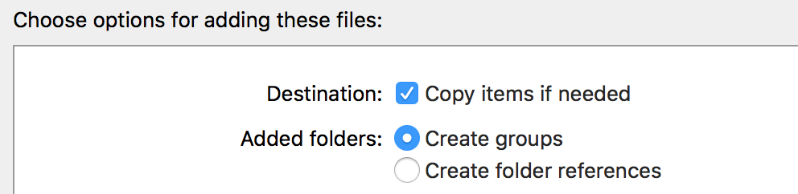
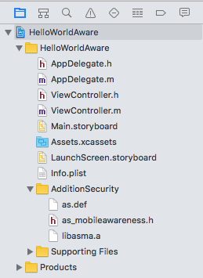
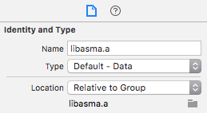
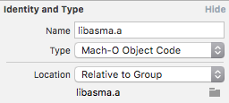
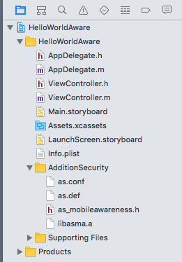
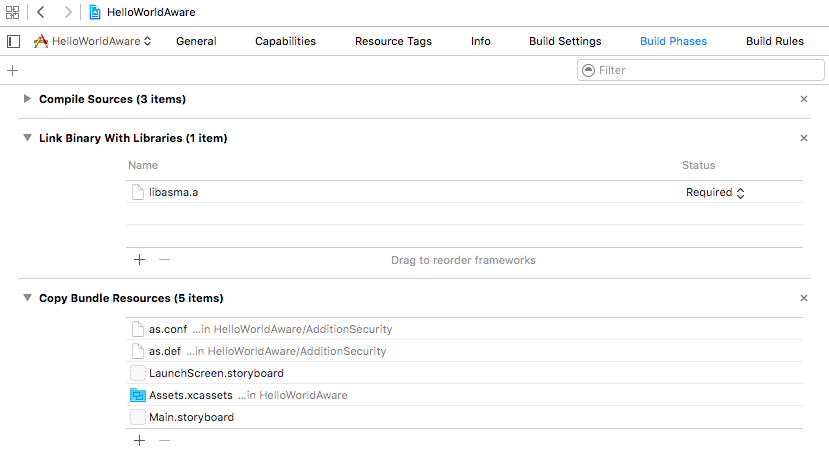
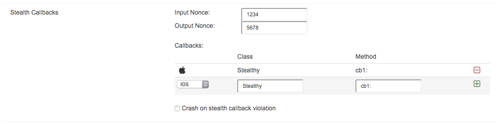
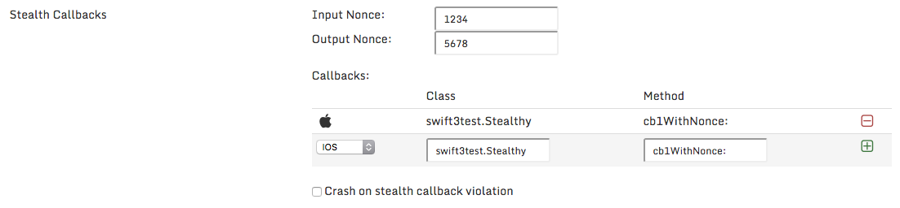

---
MobileAwareness SDK - IOS Developer Guide
---

Associated product: MobileAwareness SDK for IOS version 1.3

Overview
========

The MobileAwareness SDK for IOS is integrated into IOS applications during development. The provided static library is build-time linked into your IOS application, along with minimal application source code additions to initialize and utilize the library.

Compatibility
=============

The MobileAwareness SDK runs on IOS versions 6.0 through 10.0.

<div class="alert alert-info">WatchOS and tvOS are not supported by the MobileAwareness SDK</div>

The SDK includes support for armv7, armv7s, and arm64 devices -- which represents all shipping Apple IOS devices (iPhone, iPad, iPod). Also included are reduced functionality x86 and x86\_64 builds for use when running your application in the Apple IOS simulator.

Development support is included for C, Objective-C, Swift 2, and Swift 3 based applications.


Cryptography
------------

The MobileAwareness SDK for IOS provides various cryptographic variations
to meet security, regulation and export compliance requirements.

 | SDK Name | Cryptography Description | FIPS Certified |
 | -------- | ------------------------ | ______________ |
 | Standalone | Includes an internal copy of mbedTLS cryptography library; mbedTLS APIs are reusable by the application for other purposes<br/>Cryptography export required | No |
 | SystemCrypto | Utilizes existing system-provided cryptography<br/>Cryptography export not required | Yes; certs \#1963, \#2020, \#2396, \#2609 |


Performance Impact
------------------

The MobileAwareness SDK is designed to return control back to your application quickly, to prevent any startup delays. Further execution happens in parallel/asynchronously.

Below are some example performance measurements on various IOS devices for the `AS_Initialize()` call (blocking synchronous startup) and the total time of `AS_Initialize()` call up to the point of receiving the `InitializationComplete` message (total synchronous + asynchronous execution time).

| Device | Blocking synchronous startup | Total sync + async time |
| ----- | ----- | ----- |
| iPhone 4S | 0.08 seconds | 0.45 seconds |
| iPod Touch 5th gen | 0.08 seconds | 0.39 seconds |
| iPad Mini w/ Retina | 0.02 seconds | 0.10 seconds |
 


Application Size Impact
-----------------------

The MobileAwareness SDK contains object code that needs to be included for each hardware architecture (armv7, armv7s, arm64), along with the necessary shared/common data files (`as.conf`, `as.def`). Approximate size estimates are listed in the table below.

  **Component**         | **Size - Standalone Crypto** | **Size - System Crypto**
  ---------------------- |--------------------- | ------
  Armv7 object code      |   250KB   | 120KB                           
  Armv7s object code     |   250KB   | 120KB            
  Arm64 object code      |   350KB   | 170KB                       
  As.conf file           |   1KB (typical)  | 1KB (typical)                 
  As.def file            |   20KB (typical) | 20KB (typical)
  **TOTAL ADDED SIZE**   | **Approx. 900KB** | **Approx. 450KB**

Total size is dependent upon how many hardware architectures are included in your target application build (armv7, armv7s, and/or arm64).


Components
==============

The MobileAwareness SDK involves the use of four primary components:

| Component Type | Component Name | Description |
| --------------  | -------------- | ----------- |
| Header file | as\_mobileawareness.h |  Source code header file |
| Library file | libasma.a | Static library object code for ARMv7, ARMv7s, ARM64, x86 (simulator) and x86\_64 (simulator) |
| Definitions file | as.def | Security definitions data (e.g. malware signatures), packaged with the application |
| Configuration file | as.conf | Customer-specific configuration and license file generated by the Addition Security customer portal, packaged with the application |


### Configuration File (as.conf)

The `as.conf` configuration file is customer-specific and **not include in the general SDK distribution**. You need to go to the Addition Security customer portal to specify your particular configuration options and generate a signed configuration file for inclusion with your application.

### Definitions File (as.def)

The `as.def` definitions file contains various malware and security definitions, which are frequently updated. The SDK distribution includes the latest definitions file at the time of the SDK release, but newer versions may be available via the Addition Security portal for download and inclusion into your application.

### Static Library (libasma.a)

The multi-architecture static library file contains the MobileAwareness object code for linking with your application. All supported architectures are included in the single file.

### Header File (as\_mobileawareness.h)

The source code header file you `\#import`/`\#include` into your application code.


SDK Distribution (.zip)
======================

The distributed SDK file contains:

| Folder | Description |
| ----- | ----- |
| examples/ | various source code examples |
| sdk_standalone/ | SDK components using standalone/internal (mbedTLS) cryptography
| sdk_systemcrypto/ | SDK components using IOS system cryptography


Build Environment Setup
=======================

<div class="alert alert-info"><b>Prerequisite: Generate a configuration file (as.conf)</b><br/>
Log into the Addition Security customer portal to generate and download a default configuration (as.conf) file. You can update this file with a more specific configuration later; this guide shows you the initial integration of this file into your application build environment.</div>

XCode 7/8
---------

Drag the `AdditionSecurity/` sub-folder under the `sdk_standalone/` (if using the standalone/internal cryptography) or the `sdk_systemcrypto/` (if using system cryptography) SDK distribution folder into your open XCode project files list. You will be prompted for options to add the files; select ***“Copy items if needed”*** and ***“Create Groups”***.



You should see the `AdditionSecurity` folder in your project file listing contains the main SDK components.



Click on the `libasma.a` file to select it, and then view the ***“Identity and Type”*** window (typically in the top right corner of the XCode IDE). The default ***“Type”*** for `libasm.a` is ***“Default - Data”***.



Change the ***“Type”*** to ***“Mach-O Object Code”***.



Next, drag the `as.conf` configuration file (downloaded from the Addition Security customer portal) into the `AdditionSecurity/` folder of your XCode project.



Finally, open your project’s target ***“Build Phases”*** and confirm the following:

-   ***“Link Binary With Libraries”*** includes `libasma.a`

-   ***“Copy Bundle Resources”*** includes `as.conf` and `as.def`; click the ***“+”*** icon to add any missing file(s)




<div class="alert alert-info">The MobileAwareness SDK supports IOS 6.0 and later. Be sure to set your <i>“Deployment Target”</i> to a minimum of 6.0. It is available under <i>“General”</i> settings.  Newer XCode versions may limit the minimum to IOS 8.0.</div>

### Swift Applications: Bridging Header

If you are building a Swift-based IOS application, you will need to add an `#include` statement for the `as_mobileawareness.h` file to a "bridging header".  This allows Swift to find and utilize the MobileAwareness API functions.

**If your application does not already have a Swift bridging header:**

You will need to create a Swift bridging header file.

1. In XCode, go to `File` -> `New` -> `File...`

2. Select `Header File`, then click `Next`

3. Name the file (Save As) `Bridging-Header.h` and click `Create`

4. Open your project configuration and choose `Build Settings`

5. Under `Swift Compiler - General`, add the path to the `Bridging-Header.h` to the `Objective-C Bridging Header` configuration value.

<div class="alert alert-info">The path for the bridging header may need to include your application folder name and any relevant sub-folders.  For example, if your application is named 'myswiftapp', the path may need to be 'myswiftapp/Bridging-Header.h'</div>

**For existing/newly created Swift bridging headers:**

Add the following line to your bridging header contents:

```
#include "as_mobileawareness.h"
```


Command-Line & Other Build Environments
---------------------------------------

Integration requires three specific changes:

1.  **Building phase:** Copy the `as_mobileawareness.h` file into the source code tree appropriate for header/include files during source code compilation

2.  **Linking phase:** Configure the link/linker build step to include the `libasma.a` file

3.  **Packaging phase**: Configure the packaging build step to bundle the `as.conf` and `as.def` files into the final .IPA before signing


API Reference
======================

Please see the separate [API Reference](ASMA_IOS_Api.md) for full details.


Application Integration
=======================

Execution Lifecycle
-------------------

The application first calls the `AS_Initialize()` function to initialize the MobileAwareness SDK. The `AS_Initialize()` function will quickly return control to the application while continuing to internally asynchronously execute. The SDK will notify the application with an `InitializationComplete` message when the asynchronous execution/startup is finished.


QuickStart: Initialize the SDK
------------------------------

The `AS_Initialize()` function needs to be called at the earliest possible point in application execution. A typical and recommended location would be in the AppDelegate `didFinishLaunchingWithOptions`  or `willFinishLaunchingWithOptions` methods; other early execution locations are possible.

### Objective-C Initialization

At the top of your `AppDelegate.m file`, add an `#include` reference to the `as_mobileawareness.h` file:

```
#import "AppDelegate.h"

@interface AppDelegate ()
@end

#include "as_mobileawareness.h"

@implementation AppDelegate
...
```


Then, in your `didFinishLaunchingWithOptions` method, use the `AS_UUID_DEFAULT_IDFV` macro and call the `AS_Initialize()` function.

```
- (BOOL)application:(UIApplication *)application didFinishLaunchingWithOptions:(...)
	AS_UUID_DEFAULT_IDFV(deviceid);
	if( AS_Initialize(deviceid, NULL) != AS_INIT_SUCCESS ){
		// ... error ...
	}
```


Appropriate error handling logic should be added in the event the `AS_Initialize()` function does not return `AS_INIT_SUCCESS`. Full details regarding the `AS_UUID_DEFAULT_IDFV` macro and `AS_Initialize()` function can be found in the API Reference.

At this point, the SDK will process your `as.conf` configuration file and start sending messages to the remote network message gateway (optionally) specified in the configuration. No further application source code modifications are necessary to start remotely receiving data.


### Swift 2 Initialization

In your `AppDelegate.swift` file, within the `didFinishLaunchingWithOptions` function, add the following code to use the default `identifierForVendor` value with the `AS_Initialize()` function.

```
    func application(application: UIApplication, didFinishLaunchingWithOptions launchOptions: [NSObject: AnyObject]?) -> Bool {
        
        var uuidBytes: [UInt8] = [UInt8](count:16, repeatedValue:0)
        UIDevice.currentDevice().identifierForVendor!.getUUIDBytes(&uuidBytes)
        
        let res : CInt = AS_Initialize( &uuidBytes, nil )
        if( res != AS_INIT_SUCCESS ){
            // ... error ...
        }
	...
```

### Swift 3 Initialization

In your `AppDelegate.swift` file, within the `didFinishLaunchingWithOptions` function, add the following code to use the default `identifierForVendor` value with the `AS_Initialize()` function.

```
    func application(_ application: UIApplication, didFinishLaunchingWithOptions launchOptions: [UIApplicationLaunchOptionsKey: Any]?) -> Bool {
        
        var uuidBytes : uuid_t = UIDevice.current.identifierForVendor!.uuid
        let uuid : UnsafePointer<UInt8> = Data(bytes:&uuidBytes, count:16).withUnsafeBytes { UnsafePointer<UInt8>($0) }
        
        let res : CInt = AS_Initialize( uuid, nil )
        if( res != AS_INIT_SUCCESS ){
            // ... error ...
        }
	...
```


Receiving Feedback Into Your Application
----------------------------------------

Your application can internally receive and respond to events and observations made by the MobileAwareness SDK by defining a callback function to receive the messages, and providing the callback to the `AS_Initialize()` function call.

### Objective-C Feedback

You can use the `AS_CALLBACK` macro to define a callback function specification.

```
AS_CALLBACK(_callback)
{
	NSLog(@"ASCallback: %d/%d", msgid, msgsubid);
	// ... process and react accordingly ...
}
```

Here a callback function named `_callback` is defined. Then the function name is provided to the `AS_Initialize()` function call.

```
	AS_UUID_DEFAULT_IDFV(deviceid);
	if( AS_Initialize( deviceid, _callback ) != AS_INIT_SUCCESS ){
		// ... error ...
	}
```

### Swift 2/3 Feedback

You must define a global (non-class) function with the following parameters.

```
func _callback(msgid:Int32, msgsubid:Int32, data1:CFData?, data2:CFData?) -> Void 
{
	NSLog("ASCallback: %d/%d", msgid, msgsubid)
	// ... process and react accordingly ...
}
```

Here a callback function named `_callback` is defined. Then the function is provided to the `AS_Initialize()` function call.

```
	...
        let res : CInt = AS_Initialize( uuid, _callback )
        if( res != AS_INIT_SUCCESS ){
	...
```


Your application will now receive a copy of the messages, for local monitoring and response. Further details are included in the “Message Callback” section.

<div class="alert alert-danger">Your callback may start asynchronously receiving messages before AS_Initialize() returns; further, the callback may start receiving messages even if the AS_Initialize() function ultimately returns an error result. Thus the callback should be sufficiently readied to receive messages before the call to AS_Initialize().</div>

<div class="alert alert-info">Your callback may be invoked from arbitrary internal threads; dispatch queues are recommended if you need to manage thread context and locality.</div>


Message Callback
================

The message callback mechanism is the primary method for the application to internally receive feedback and respond to events, messages, and observations produced by the MobileAwareness SDK.

Handling Messages
-----------------

Messages utilize integer-based identifiers and sub-identifiers (see the “Message Definitions” page for a list of identifiers). A typical implementation will reference the message identifier against a conditional check to process a specific message type.

For example, a callback designed to react to an `InitializationComplete` (msgid=50) message may look like:

```
 if( msgid == 50 ){
	... react to the InitializationComplete
 }
```

It is recommended to utilize preprocessor `#define` values for message identifiers. For example:

```
#define MSG_InitializationComplete 50

  if( msgid == MSG\_InitializationComplete ){
	...
  }
```

It is *NOT* recommended to embed a dictionary of identifiers and strings/titles, as it reveals significant information to attackers during the reverse engineering process. For example, avoid the following:

```
  // AVOID DOING THIS:
  NSDictionary *msgs = @{ @50:@"InitializationComplete" };
```

It is also *NOT* recommended to include logging that reveals the nature of the message, since such information aids an attacker performing reverse engineering. For example, avoid the following:

```
#define MSG_ApplicationTamperingDetected 401

  if( msgid == MSG_ApplicationTamperingDetected ){
	// AVOID DOING THIS:
	NSLog(@”Application tampering detected!”);
	...
  }
```


Advanced Topic: Startup Completion Message
==========================================

The `AS_Initialize()` API is designed to return control back to the application as quickly as possible, in order to not affect application startup time. To achieve this, a portion of the SDK initialization occurs asynchronously at application startup. A number of security, compliance, and other device measurement tests occur in the asynchronous period of execution.

An application developer may wish to gather all MobileAwareness messages (particularly security-related messages) for assessment prior to allowing the application to operate past a certain execution point. Further, a potential security attack against the application could involve interfering with the thread responsible for the SDK asynchronous execution.

Therefore the MobileAwareness SDK will send an `InitializationComplete` message (msgid=50) to the registered message callback, signaling when the asynchronous operation is done. An application wishing to receive all possible (security) messages before proceeding should wait until the InitializationComplete message is received, and process all received results up to that point. A timer/timeout mechanism should be used to notice when an `InitializationComplete` message hasn’t been received by a certain time threshold (e.g. 5 seconds) -- this could be indicative of an internal failure or an attacker interfering with the asynchronous thread and reception of messages to the callback.


Advanced Topic: Stealth Callbacks
=================================

Stealth Callbacks are a security feature to create a strong linkage between the MobileAwareness SDK and the application. Basically the configuration file (`as.conf`) can include the name(s) of Objective-C class methods to call with particular input and output values (referred to as an “input nonce” and “output nonce”). The failure to receive the correct input value by the application, or the failure to receive the correct output value by the MobileAwareness SDK, result in integrity violations. Further, your application can be designed to note the failure to receive any stealth callbacks before an `InitializationComplete` message is received.

Up to two stealth callbacks can be configured in your application.

<div class="alert alert-info">Stealth callbacks only support Objective-C callback targets.  Swift applications can export a Swift-based function into the Objective-C namespace to use as a stealth callback.</div>


Objective-C Implementation Example
----------------------

This example creates an Objective-C class named `Stealthy`, with a class method named `cb1:` that will be used a stealth callback. The `Input Nonce` and `Output Nonce` are configured to be 1234 and 5678, respectively.

```
#import <Foundation/Foundation.h>

@interface Stealthy : NSObject
+ (uint32_t)cb1:(uint32_t)input;
@end

@implementation Stealthy
+ (uint32_t)cb1:(uint32_t)input {
	if( input != 1234 ){
		// ... integrity error, got the wrong input nonce
	}
	return 5678; // ... return the correct output nonce
}
@end

```

To use this stealth callback, you would need to generate a matching configuration in the Addition Security customer portal.




<div class="alert alert-danger">NOTE: don’t forget the “:” in the method selector name.</div>


Swift 2 Implementation Example
--------------------------

A Swift 2 implementation must delcare a `static` class function, and export it to the Objective-C namespace using `@objc` decorator.  When XCode generates the necessary Objective-C function, the class name will be prefixed with the application name.  For example, if your application name is `swift2test` and the Swift class name is `Stealthy`, the generated Objective-C class is `swift2test.Stealthy`.  It is necessary to reflect this modified class name in your `as.conf` configuration.

Example implementation.

```
import Foundation

class Stealthy {
    
    @objc static func cb1(nonce:UInt32) -> UInt32 {
        if( nonce != 1234 ){
		// ... integrity error, got the wrong input nonce
        }
        return 5678 // ... return the correct output nonce
    }
}
```

To use this stealth callback in an application called `swift2test`, you would need to generate a matching configuration in the Addition Security customer portal.


<div class="alert alert-danger">NOTE: don’t forget the “:” in the method selector name.</div>


Swift 3 Implementation Example
--------------------------

A Swift 3 implementation is very similar to a Swift 2 implementation, except XCode modifies the method name as part of the code generation process.  For example, the method `cb1(nonce:UInt32)` results in the method name of `cb1WithNonce`.  It is essential to properly configure your `as.conf` to reflect this name.

Example implementation.

```
import Foundation

class Stealthy {
    
    @objc static func cb1(nonce:UInt32) -> UInt32 {
        if( nonce != 1234 ){
		// ... integrity error, got the wrong input nonce
        }
        return 5678 // ... return the correct output nonce
    }
}
```

To use this stealth callback in an application called `swift3test`, you would need to generate a matching configuration in the Addition Security customer portal.



<div class="alert alert-danger">NOTE: don’t forget the “:” in the method selector name.  And remember that Swift 3 method names are mangled to include the parameter name.</div>

Hiding & Overloading Stealth Callback Operation
-----------------------------------------------

The “stealth” part of stealth callbacks comes from the notion of hiding the stealth callback function in your application in a manner that doesn’t make it obvious to reverse engineers. Ideally, you will add the callback function to an already-existing Objective-C class so there is no purpose-specific class that may stand out when reverse engineered.

It is further recommended that you “overload” the function of the callback. In other words, re-use the function to perform actual application calculations, if possible. In this manner, the input of the particular `Input Nonce` acts as a trigger for the function to return the `Output Nonce`; otherwise, the function performs some other intended operation that the application uses. This helps “hide” the callback’s purpose from reverse engineering.

In the below example, we have a `StringTools` class that should contain multiple utility functions. One of the functions, `calculateMaxStringSize`, acts as our callback when the specific input value is provided. Otherwise the function returns a benign calculation.

```
//
// StringTools.m
//

#import <Foundation/Foundation.h>

@interface StringTools : NSObject
+ (uint32_t)calculateMaxStringSize:(uint32_t)input;
// ... other definitions of usable functions
@end

@implementation StringTools
+ (uint32_t)calculateMaxStringSize:(uint32_t)input {
	uint32_t return_value = 0;
	
	// ... preferably some leading calculation/logic
	return_value = (input + 256) % 256;
	
	if( input == 1234 ){ // stealth callback input nonce
		// This is the stealth callback
		// ... record having seen the stealth callback in a global variable
		return_value = 5678; // return the correct output nonce
	}
	return return_value;
}

// ... other functions
@end

```

Saving an indicator that the stealth callback was called is required if you want to determine if the stealth callback was never invoked; see the section “Advanced Topic: Catching Application Tampering” for further details.

Debugging & Testing Stealth Callbacks
-------------------------------------

The simulator builds of the MobileAwareness SDK include diagnostic reporting support to help troubleshoot and test stealth callback operation.

Console output will appear when running a simulator build, which indicates:

-   A stealth callback will be attempted, including the class and method name

-   A failure to resolve a stealth callback class name

-   A failure to resolve a stealth callback method selector/name

-   A failure for the stealth callback function to return the expected output nonce result

This information can be used to confirm the configured attempted stealth callback class names, methods, and output values match the implementation in the application.

For example:


<div class="alert alert-info">NOTE: stealth callback troubleshooting information only appears in simulator builds/execution</div>


### Debugging Swift 3 Method Name Mangling

The method name mangling generated by Swift 3 by not be obvious; fortunately there is a troubleshooting method to confirm the correct method name.

First, modify the Swift class containing the stealth callback function to inherit from `NSObject`.  For example, given a class definition of `class Stealthy`, change it to `class Stealthy : NSObject`.

Next, build your application.  In your local `Library/Developer/Xcode/DerivedData/` folder, within a sub-folder for your application and target build, there will be a generated (appname)-Swift.h file.  For example, for an application named 'swift3test' building a Debug build for the simulator, the path would resemble:

```
Library/Developer/Xcode/DerivedData/swift3test-fxvthmwlvhkqvsepjuopvwyhwohy/Build/Intermediates/swift3test.build/Debug-iphonesimulator/swift3test.build/DerivedSources/swift3test-Swift.h
```

Open this file; within should be the generated Objective-C class declarations, including the resulting mangled method name.  For example:

```
SWIFT_CLASS("_TtC10swift3test8Stealthy")
@interface Stealthy : NSObject
+ (uint32_t)cb1WithNonce:(uint32_t)nonce;
- (nonnull instancetype)init OBJC_DESIGNATED_INITIALIZER;
@end
```

In this example, we see the `cb1` function was generated with a name of `cb1WithNonce`.


Advanced Topic: Catching Application Tampering
==============================================

The MobileAwareness SDK provides a comprehensive set of capabilities to detect application tampering. It is important to understand all the ways the MobileAwareness SDK may inform the application of an application tampering violation.

The following is a list of operations that indicate an application tampering event:

-   `AS_Initialize()` returns `AS_INIT_ERR_INTEGRITY`

-   An `InitializationComplete` message is not received by the message callback

-   A stealth callback does not receive the correct input nonce

-   All configured stealth callbacks are not called with correct input nonces before the `InitializationComplete` message is received by the message callback

-   The message callback receives any of the following types of messages:

    -   Security Expectation Failure

    -   Debug/Instrumentation Artifact

    -   Application Tampering Detected

    -   Application Encryption Disabled

    -   Stealth Callback Failure

    -   Application Unsigned

    -   Provisioning Missing

    -   Provisioning Corrupted

-   The signer information included in the `ApplicationSigner` message does not match any expected signer(s)

-   The signer information included in the `ProvisioningSigner` message does not match any expected signer(s)

-   The digest information included in the `ApplicationMeasurement` message does not match the expected SHA-1 hash of the executable file

    -   ***NOTE: this hash may change if you allow the Apple AppStore to recompile bitcode***

Simulator Operational Differences
=================================

The MobileAwareness SDK includes appropriate builds for use in the XCode/IOS simulator. All functionality to test the application integration and lifecycle with the MobileAwareness SDK (e.g. all APIs, stealth callbacks, and `InitializationComplete` message) are fully operational. Other operational items are not included in the simulator builds.

Notably, the following differences exist in MobileAwareness simulator builds:

-   Application integrity & debugger checks are disabled

-   System security checks are disabled
