---
MobileAwareness Plugin for Kony - Developer Guide
---

Associated products:

* MobileAwareness Plugin for Kony version 1.3
* MobileAwareness SDK for IOS version 1.3
* MobileAwareness SDK for Android version 1.3

Overview
========

The MobileAwareness Plugin for Kony provides native Kony platform integration of the MobileAwareness SDK for IOS and Android. The provided materials are build-time included into your Kony application, along with minimal application Javascript source code additions to initialize and utilize the MobileAwareness libraries.


Compatibility
=============

The MobileAwareness Plugin for Kony works with Kony Studio 6.5, for native IOS (iphone, ipad) and Android (phone, tablet) applications.  

SPA and web applications are not supported with MobileAwareness functionality, but can still be built and executed via the mock platform support provided by the MobileAwareness plugin.


Components
==============

The MobileAwareness Plugin for Kony provides the following components:

| Component Name | Description |
| -------------- | ----------- |
|  MobileAwareness.js |  Module file containing APIs used by your application, and security response code |
| MobileAwareness FFI | Kony FFI definition for IOS and Android platforms |
| customlibs - ipad/iphone | MobileAwareness SDK for IOS components |
| customlibs - android/tabrcandroid | MobileAwareness SDK for Android components |
| resources/assets - android/tabrcandroid | MobileAwareness SDK for Android components |


The component relationship and architecture diagram:
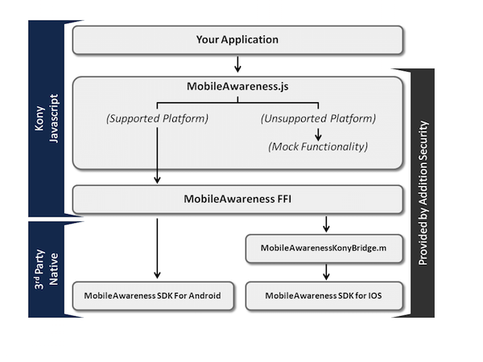

The `MobileAwareness.js` file contains compile time (`#ifdef`) determination of supported and unsupported platforms.  Supported platforms (android, tabrcandroid, iphone, ipad) pass through to the FFI layer, while all other (unsupported platforms) contain mock/stub function that always return success.  All of your platform-agonstic logic & code can freely use the functionality provided by the MobileAwareness plugin without having to determine platform support outside the `MobileAwareness.js` file.


Plugin Distribution (.zip)
======================

The plugin distribution file is designed to be directly imported into Kony Studio without needing to unzip or access any internal contents.  However, if you wish to manually merge the plugin contents into your Kony Studio project, you will need to appropriately merge in all of the listed files.

| File/Folder | Description |
| ----- | ----- |
| jsFfiMappings.xml | Importable FFI definitions |
| modules/js/MobileAwareness.js | MobileAwareness module source code |
| resources/customlibs/jsSrc/* | Kony-generated FFI source code |
| resources/customlibs/jsXml/* | Kony-generated FFI source code |
| resources/customlibs/lib/android/* | Android phone native library files |
| resources/customlibs/lib/tabrcandroid/* | Android tablet native library files |
| resources/customlibs/lib/iphone/* | IOS phone native library files |
| resources/customlibs/lib/ipad/* | IOS tablet native library files |
| resources/mobile/native/android/assets/* | Android phone data files |
| resources/tablet/native/andriodtab/assets/* | Android tablet data files<br/>(**NOTE:** Kony Studio 6.5 requires the specific `andriodtab` spelling) |


Build Environment Setup
=======================

<div class="alert alert-info"><b>Prerequisite: Generate a configuration file (as.conf)</b><br/>
Log into the Addition Security customer portal to generate and download a default configuration (as.conf) file. You can update this file with a more specific configuration later; this guide shows you the initial integration of this file into your application build environment.</div>

Kony Studio 6.5
---------

Open an existing application project or create a new application project in Kony Studio.

Right click on your application, and select `Import -> Custom Libraries...`  Select the Addition Security provided `MobileAwareness_Plugin_for_Kony.zip` file.

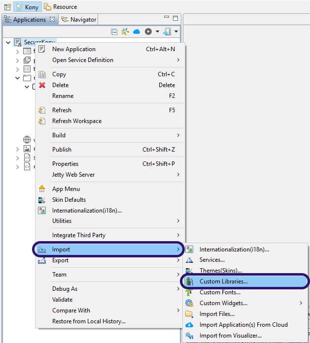

Kony Studio will import the MobileAwareness components into your project.  After the import is complete, you can refresh (`File -> Refresh` or F5) and see the `MobileAwareness.js` module added to your project.

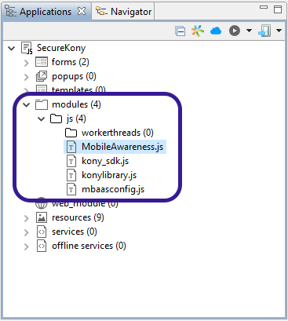

Switching to the `Navigator` view and expanding your application's folders, you can see the MobileAwareness components added to the `resources/customlibs` directory.

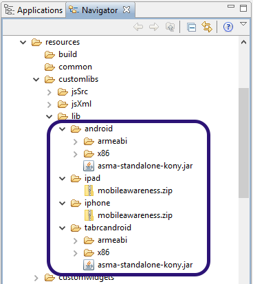

In the `resources/mobile` and `resources/tablet` directories, you will see new Android assets added.

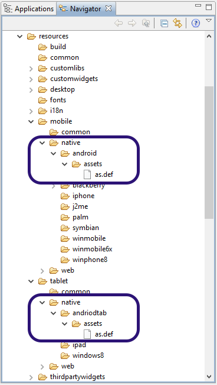


### Adding configuration file to project

The `as.conf` configuration file is downloaded from the Addition Security customer portal, and contains various configuration and license information.  Since the configuration and license information is particular to you, you must add your `as.conf` file into your project separate from importing the plugin.

First, right click on your `as.conf` file and select copy.  Then, in the `Navigator` view of your project, paste the `as.conf` file into the following two directories (which already contain an `as.def` file):

* resources/mobile/native/android/assets/
* resources/tablet/native/andriodtab/assets/

Your results should look like:

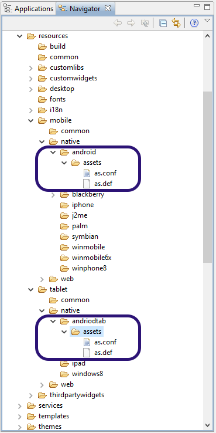

Second, you need to create a `.zip` file containing your `as.conf` file.  Kony Studio expects IOS asset files to be within a `.zip` file or the assets will not be properly included in the application.

**How to zip on OS X:**
Right click on the `as.conf` file, and select `Compress "as.conf"`

**How to zip on Windows:**
Right click on the `as.conf` file, and select `Send to -> Compressed (zipped) folder`

Lastly, right click on your zipped file and select copy.  Then, in the `Navigator` view of your project, paste the zipped file into the following two directories (which already contain a `mobileawareness.zip` file):

* resources/customlibs/lib/ipad/
* resources/customlibs/lib/iphone/

Your results should look like:

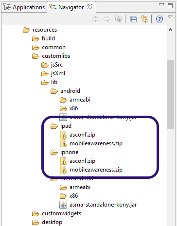


### Adjusting Android application properties

Right click on your application and select `Properties`.

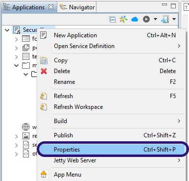

Select the `Native` tab, then the `Android` tab.  Under `SDK Versions`, the `Minimum` value should be set to 4.0 or higher.

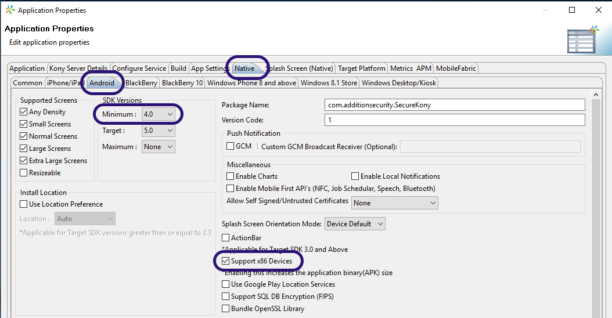

You should also note the checkbox for `Support x86 Devices`.

The MobileAwarness plugin for Kony includes Android x86 libraries in the `customlibs/` directory.  Kony Studio always includes these x86 libraries in the built Android APK file.  However, if the x86 support chebkbox is disabled/not checked, Kony Studio will not include the other necessary library files to properly support the x86 platform. **This will lead to your application crashing on x86 devices due to missing libraries** since the presence of *any* x86 libraries in your APK file is a signal to Google Play and Android devices that the APK natively supports x86 devices.  

<div class="alert alert-danger">Please read this section carefully; failure to determine proper x86 device support may lead to application crashes on x86 devices</div>

**If the 'Support x86 Devices' box is already checked:**

Presumably this is an existing app that already supports x86.  No further actions are required to continue to support x86.

**If the 'Support x86 Devices' box is unchecked:**

This is either a new application or an existing application that hasn't explicitly enabled x86 support (intentionally or inheriting the default settings).  You must determine if it's appropriate to enable x86 support for your application, or you must remove x86 Android libraries imported via the MobileAwareness plugin.

**You must determine if all Android native customlibs (current and future inclusion) include x86 support** before you can properly enable the checkbox.  You can generically determine compatibility by comparing the contents of the `customlibs/lib/android/armeabi` and `customlibs/lib/android/x86` folders.

* If both `armeabi` and `x86` folders only contain the MobileAwareness `libasma.so` file, you can enable x86 support since no other custom Android native libraries are currently in use; if that changes in the future, you will need to re-evaluate
* If both the `armeabi` and `x86` folders contain multiple files, and the names in the folders match, you can safely assume all existing custom Android native libraries support both ARM and x86 devices
* If there are files in `armeabi` folder that are not found in the `x86` folder (particularly if the `armeabi` folder contains many files while the `x86` folder contains only the `libasma.so` file), then x86 native architecture is **NOT** supported and you **MUST** remove the MobileAwareness x86 library files

If you determine that x86 architecture is not supported, you must ensure the `Support x86 Devices` checkbox property is unchecked, and you must delete the `customlibs/lib/android/x86` and `customlibs/lib/tabrcandroid/x86` folders from your project.


Application Integration
=======================

Execution Lifecycle
-------------------

The application first calls the `MobileAwareness_init()` function to initialize the MobileAwareness SDK. The `MobileAwareness_init()` function will quickly return control to the application while continuing to internally asynchronously execute. The SDK will notify the application via an asynchronouse callback (included in `MobileAwareness.js`)  with an `InitializationComplete` message when the asynchronous execution/startup is finished.

Afterwards, the application can rely on receiving further real-time security events via the asynchronous callback, or explicitly poll for certain security conditions via the various provided APIs.

QuickStart: Initialize the SDK
------------------------------

The `MobileAwareness_init()` function needs to be called at the earliest possible point in application execution.  A typical and recommended location would be in the pre-appinit handler.

Right click on your application and select `Properties`.  Under the `Application` tab, note the `pre-appinit` values for both Phone and Tablets.  They may be empty ("Not Defined") or they may already exist ("Defined").

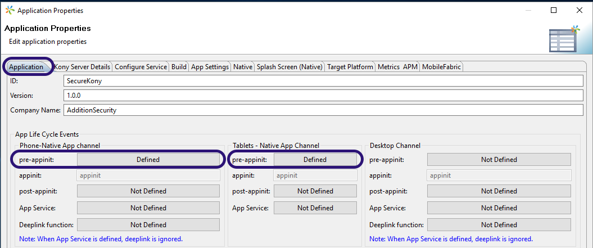

### Adding a new pre-appinit handler

Click the "Not Defined" button for `pre-appinit`.  The Event Editor will pop up.

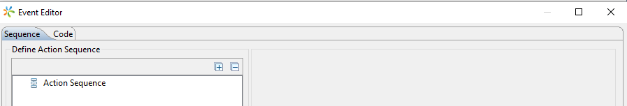

Right-click on `Action Sequence` and select `Invoke Function`.

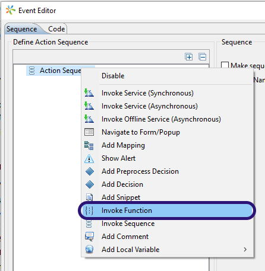

In the `Select Function` drop-down, select the `MobileAwareness_init` function.

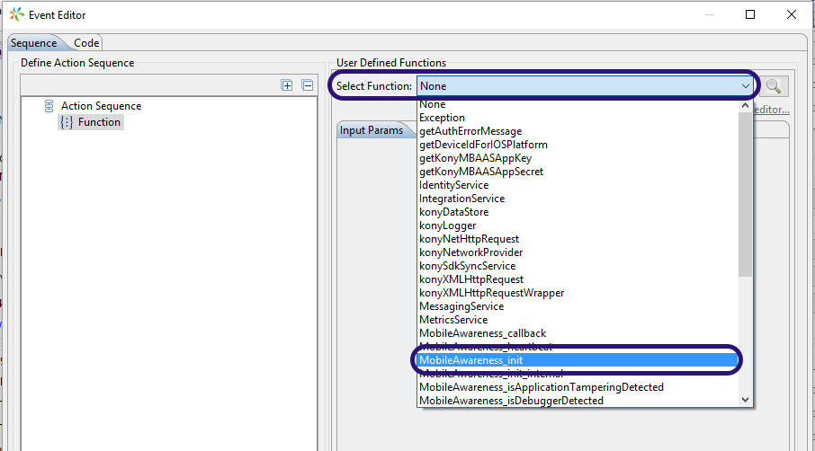

No input parameters or other configuration is needed.  Click `OK` to complete the configuration.

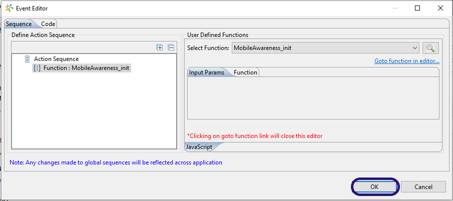

This process should be repeated for both the phone `pre-appinit` and tablet `pre-appinit`.


### Adding to an existing pre-appinit handler

You will need to evaluate your existing `pre-appinit` handler and decide how to include a call to `MobileAwareness_init()`.  For example, it may be possible to add a function invocation to the existing sequence, or you may want to add the single `MobileAwareness_init()` call into an existing function that is already configured to be called by your `pre-appinit` handler.


Receiving Feedback Into Your Application
----------------------------------------

The `MobileAwareness.js` module includes a `MobileAwareness_callback()` function template that serves as an asynchronous callback handler.  Your application can internally receive and respond to events and observations made from the MobileAwareness SDK by implementing appropriate response logic into the `MobileAwareness_callback()` function template.

<div class="alert alert-danger">The callback may start asynchronously receiving messages before MobileAwareness_init() returns; further, the callback may start receiving messages even if the MobileAwareness_init() function ultimately returns an error result. Thus the callback should be sufficiently readied to receive messages before the call to MobileAwareness_init().</div>


Message Callback
================

The message callback mechanism is the primary method for the application to internally receive real-time feedback and respond to events, messages, and observations produced by the MobileAwareness SDK.

Handling Messages
-----------------

Messages utilize integer-based identifiers and sub-identifiers (see the “Message Definitions” page for a list of identifiers). A typical implementation will reference the message identifier against a conditional check to process a specific message type.

For example, a callback designed to react to a `DebuggerDetected` (msgid=400) message may look like:

```
 if( msgid == 400 ){
	// ... react to the DebuggerDetected event
	kony.ui.Alert({"message":"Debugger detected!"},{});
 }
```

The `MobileAwareness_callback()` function template in the `MobileAwareness.js` module already includes multiple categories of detected items and the location to insert response logic.  You should implement appropriate response logic for the categories/threats of interest, and delete the template logic for any unused categories.

Response logic is custom and particular to your application and the mobile experience you want to provide.  Typical responses could include:

* Display a notice to the user regarding a security violation 
* Delete sensitive data or session tokens
* Reduce or disable application functionality or features
* Prompt to re-login or use 2nd factor authentication
* Make an API call to a backend mobile service
* Change/update information in a transaction message
* Gracefully exit the application
* Crash the application
* etc.

Please see the full `MobileAwareness_callback()` function template in the `MobileAwareness.js` module for full details.


API Reference
=============


### API Summary

Addition Security provides the MobileAwareness module containing the following APIs:

*Required use APIs*:

-	**MobileAwareness_init()** - main function to initialize SDK operation for use

*Optional use APIs*:

-   **MobileAwareness_registerIdentity()** - called after user authentication, to inform the SDK of the user identity for tracking and correlation purposes

-   **MobileAwareness_loginStatus()** - called after successful & unsuccessful authentication attempts, for authentication tracking

-   **MobileAwareness_sendMessage()** - send arbitrary data to the remote message gateway

-   **MobileAwareness_networkReachability()** - inform the SDK of a change in network availability/reachability, triggering network security checks and message flush

-	**MobileAwareness_heartbeat()** - request the SDK perform an on-demand security re-check

-   **MobileAwareness_version()** - the version of the embedded SDK
- **MobileAwareness_isJailbroken()** - direct inquiry if device is rooted/jailbroken
- **MobileAwareness_isHackingToolInstalled()** - direct inquiry if a known hacking/tampering tool is installed on the device
- **MobileAwareness_isSecurityViolationEncountered()** - direct inquiry whether an internal integrity or securtiy operation failed, which strongly indicates an application tampering or device tampering scenario
- **MobileAwareness_isDebuggerDetected()** - direct inquiry if a debugger has been detected
- **MobileAwareness_isApplicationTamperingDetected()** - direct inquiry if an application tampering attack has been detected
- **MobileAwareness_isNetworkAttackDetected()** - direct inquiry if a network man-in-the-middle attack has been detected
- **MobileAwareness_isMalwareDetected()** - direct inquiry if any known malware was detected
- **MobileAwareness_isGameCheatToolDetected()** - direct inquiry if game cheating or in-app purchasing fraud tools are installed
- **MobileAwareness_isDeveloperArtifactsDetected()** - direct inquiry if any development-related artifacts have been detected (expected in pre-production, not expected in production)


### init

```
function MobileAwareness_init()
```

  Returns   | Description
  -------    | -----------
  0 | MobileAwareness library successfully initialized
  -1 | The library failed to initialize for an unspecified reason and is not usable
  -2 | The configuration file does not contain a valid license for the this application
  -3 | A security-related integrity failure event occurred during initialization;<br>**NOTE:** this should be treated as a security indicator of application tampering
  
This is the primary initialization function of the library, and a successful call is required for proper library operation.

### registerIdentity

```
function MobileAwareness_registerIdentity( identity )
```


   Inputs    | Description
  -------  | -----------
  identity | A string of relevant user identity, e.g. email address
 
  Returns    | Description
  -------    | -----------
  0 | Identity successfully registered
  -1 | Internal operational failure
 
An optional API to associate an application-specific user identity with the existing application session. The registered user identity is used to associate the application instance with a confirmed user identity, for event correlation purposes. The provided identity will be sent in a `IdentityRegistration` message, and subsequently included all messages as `accountName2` to the remote network message gateway. This function can be called multiple times with the same or different values -- only the last value will be used. 

Further, the provided identity will be stored and retrieved on future application restarts automatically (unless the *“Disable persistent registered identity”* configuration option is specified in your `as.conf` configuration), which alleviates the need to call this function upon every application restart. E.g. the application remembers the user authentication and does not perform the authentication process upon successive restarts and thus doesn’t call the `MobileAwareness_registerIdentity()` function upon successive restarts.

Typical usage would be to call the `MobileAwareness_registerIdentity()` with a confirmed user login name/email address after the user successfully authenticates to the application, at the natural point when the application prompts the user for authentication.  Alternatively, you can call the function with a session token or other ephemeral identification token.

### loginStatus

```
function MobileAwareness_loginStatus( status )
```

   Inputs    | Description
  -------  | -----------
  status | boolean true = a successful login event; or<br>boolean false = an unsuccessful login event
 

An optional API to to provide authentication status messages to the remote network message gateway. The messages are received and processed by the gateway as `LoginSuccessful` and `LoginUnsuccessful` messages.

Typical usage would call `MobileAwareness_loginStatus(false)` for each failed authentication attempt to the application, and `MobileAwareness_loginStatus(true)` (potentially in tandem with `MobileAwareness_registerIdentity`) upon successful authentication to the application.


### sendMessage

```
function MobileAwareness_sendMessage( msgid, data )
```


   Inputs    | Description
  -------  | -----------
  msgid | An integer value between 0 and 0xffff0000
  data | A string of data to send in the message, of less than 4096 UTF-8 bytes; zero length strings are allowable
 
  Returns    | Description
  -------    | -----------
  0 | Message successfully queued for sending
  -1 | Internal operational failure
 
 
An optional API to send arbitrary messages/data to the remote network message gateway. The messages are received and processed by the gateway in `CustomerMessage` messages where the message subID is set to the specified `msgid` input value, and the message string is set to the `data` input value.

**The maximum `data` size supported is 4096 UTF-8 bytes.**

Typical usage would allow the application to include arbitrary messages into the remote message data stream; message IDs (`msgid`) would be defined for certain meanings proprietary to the customer, and the data (`data`) would be relevant data for that defined message. Binary data can be either Base64 or ASCII hex-encoded before being provided to this API. Numeric data should be converted to a string before being provided to this API.


### networkReachability

```
function MobileAwareness_networkReachability()
```

An optional API to inform the library of a network availability change/event. A call will trigger the library to perform any network-particular operations (man-in-the-middle testing, etc.), and attempt to flush any queued messages to the remote network message gateway.

### heartbeat

```
function MobileAwareness_heartbeat( input )
```

   Inputs    | Description
  -------  | -----------
  input | The `Input Nonce` value defined in the `as.conf` configuration
 

  Returns    | Description
  -------    | -----------
  output | The `Output Nonce` value defined in the `as.conf` configuration

The optional `MobileAwareness_heartbeat()` API is used to request an on-demand security re-check by the MobileAwareness SDK.  Typically an application would periodically call `MobileAwareness_heartbeat()`, particularly before any security-sensitive operations.

The `MobileAwareness_heartbeat()` function also creates a bidirectional handshake between the application and the SDK, where the application provides the SDK a specific input value (the `Input Nonce`), the SDK verifies it received the correct value, and returns the expected `Output Nonce`, where the application can verify it received the proper result.  


### version

```
function MobileAwareness_version()
```

  Returns    | Description
  -------    | -----------
  Library version | An integer representing the MobileAwareness SDK build version


An optional API to retrieve the library version number.

### isJailbroken

```
function MobileAwareness_isJailbroken()
```

  Returns | Description
  --- | ---
  true | Device has been determined to be rooted/jailbroken
  false | Device has no indicator of being rooted/jailbroken

A direct API to determine the last known security state.  This API can be called by the application at any time.


### isHackingToolInstalled

```
function MobileAwareness_isHackingToolInstalled()
```

  Returns | Description
  --- | ---
  true | Device has a known application tampering or hacking tool installed
  false | No suspicion found

A direct API to determine the last known security state.  This API can be called by the application at any time.

### isSecurityViolationEncountered

```
function MobileAwareness_isSecurityViolationEncountered()
```

  Returns | Description
  --- | ---
  true | The application encountered a runtime security violation
  false | No violations encountered

A direct API to determine the last known security state.  This API can be called by the application at any time.


### isDebuggerDetected

```
function MobileAwareness_isDebuggerDetected()
```

  Returns | Description
  --- | ---
  true | The application encountered a debugger
  false | No violations encountered

A direct API to determine the last known security state.  This API can be called by the application at any time.

### isApplicationTamperingDetected

```
function MobileAwareness_isApplicationTamperingDetected()
```

  Returns | Description
  --- | ---
  true | An active application tampering/attack was encountered
  false | No encounters

A direct API to determine the last known security state.  This API can be called by the application at any time.


### isNetworkAttackDetected

```
function MobileAwareness_isNetworkAttackDetected()
```

  Returns | Description
  --- | ---
  true | A network man-in-the-middle attack was detected
  false | No network attacks detected

A direct API to determine the last known security state.  This API can be called by the application at any time.


### isMalwareDetected

```
function MobileAwareness_isMalwareDetected()
```

  Returns | Description
  --- | ---
  true | Known malware was detected
  false | No known malware detected

A direct API to determine the last known security state.  This API can be called by the application at any time.


### isGameCheatToolDetected

```
function MobileAwareness_isGameCheatToolDetected()
```

  Returns | Description
  --- | ---
  true | A known game cheating or in-app purchasing fraud tool was detected
  false | No encounters

A direct API to determine the last known security state.  This API can be called by the application at any time.

### isDeveloperArtifactsDetected

```
function MobileAwareness_isDeveloperArtifactsDetected()
```

  Returns | Description
  --- | ---
  true | A development-related artifact was encountered
  false | No encounters

A direct API to determine the last known security state.  This API can be called by the application at any time.

<div class="alert alert-info">NOTE: development artifacts are expected when running applications during development/pre-release testing.  However, once released to production, the production applications should not encounter developer artifacts -- any such encounter would indicate an application tampering attempt.</div>


### Message callback

The `MobileAwareness_callback()` function is defined in the `MobileAwareness.js` module. It is called by the SDK to return results to the application, and is **NOT** directly called by the application.

```
function MobileAwareness_callback( msgid, msgsubid, data1, data2 )
```

   Inputs    | Description
  -------  | -----------
  msgid | A non-zero numerical identifier (int) representing a specific event/message
  msgsubid| An optional non-zero numerical identifier (int) representing a secondary identifier for the given `msgid`; or zero if not used
  data1 | An optional string value related to the particular specified `msgid`, or null
  data2 | An optional string value related to the particular specified `msgid`, or null


The message callback mechanism is the primary method for the application to internally receive feedback and respond to events, messages, and observations produced by the MobileAwareness SDK.


***Notes on Data1/Data2***

The contents of `data1`/`data2` are particular to the `msgid`, and may be a human readable string or a string representing a hex-encoded binary value.

<div class="alert alert-danger">Both data1 and data2 may be null; check values before using</div>
