> [*Overview*]
>
> [*Public Messaging Gateway*]
>
&nbsp;&nbsp;&nbsp;&nbsp;> [*To disable sending messages to a remote gateway*]
>
&nbsp;&nbsp;&nbsp;&nbsp;> [*To enable sending messages to a remote gateway*]
>
&nbsp;&nbsp;&nbsp;&nbsp;&nbsp;&nbsp;&nbsp;&nbsp;> [*URL*]
>
&nbsp;&nbsp;&nbsp;&nbsp;&nbsp;&nbsp;&nbsp;&nbsp;> [*HPKP Primary Pin*]
>
&nbsp;&nbsp;&nbsp;&nbsp;&nbsp;&nbsp;&nbsp;&nbsp;> [*HPKP Backup Pin*]
>
> [*Stealth Callbacks*]
>
&nbsp;&nbsp;&nbsp;&nbsp;> [*To disable stealth callbacks*]
>
&nbsp;&nbsp;&nbsp;&nbsp;> [*To enable stealth callbacks*]
>
&nbsp;&nbsp;&nbsp;&nbsp;&nbsp;&nbsp;&nbsp;&nbsp;> [*Input Nonce & Output Nonce*]
>
&nbsp;&nbsp;&nbsp;&nbsp;&nbsp;&nbsp;&nbsp;&nbsp;> [*Callbacks list*]
>
&nbsp;&nbsp;&nbsp;&nbsp;&nbsp;&nbsp;&nbsp;&nbsp;&nbsp;&nbsp;&nbsp;&nbsp;> [*Adding an IOS stealth callback*]
>
&nbsp;&nbsp;&nbsp;&nbsp;&nbsp;&nbsp;&nbsp;&nbsp;&nbsp;&nbsp;&nbsp;&nbsp;> [*Adding an Android stealth callback*]
>
&nbsp;&nbsp;&nbsp;&nbsp;&nbsp;&nbsp;&nbsp;&nbsp;&nbsp;&nbsp;&nbsp;&nbsp;> [*Removing an existing callback*]
>
&nbsp;&nbsp;&nbsp;&nbsp;&nbsp;&nbsp;&nbsp;&nbsp;> [*Crash on stealth callback violation*]
>
&nbsp;&nbsp;&nbsp;&nbsp;&nbsp;&nbsp;&nbsp;&nbsp;&nbsp;&nbsp;&nbsp;&nbsp;> [*To enable crashing on stealth callback violation*]
>
&nbsp;&nbsp;&nbsp;&nbsp;&nbsp;&nbsp;&nbsp;&nbsp;&nbsp;&nbsp;&nbsp;&nbsp;> [*To disable crashing on stealth callback violation*]
>
> [*Misc Options*]
>
&nbsp;&nbsp;&nbsp;&nbsp;> [*Disable message de-duplication/coalescing*]
>
&nbsp;&nbsp;&nbsp;&nbsp;> [*Disable error reports to AdditionSecurity*]
>
&nbsp;&nbsp;&nbsp;&nbsp;> [*Disable persistence of user identity*]
>
> [*Save & Generate Configuration*]

Overview
========

This reference guide explains the configuration options in the AdditionSecurity portal for the MobileAwareness product.

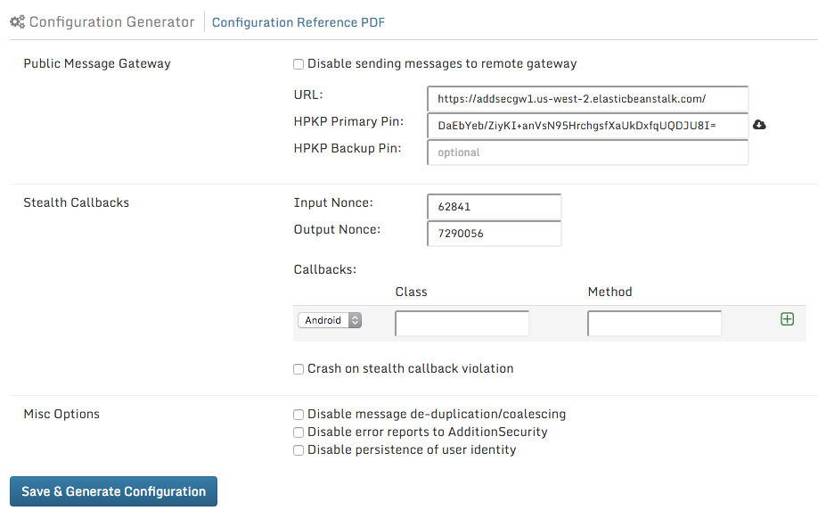

Public Messaging Gateway
========================

MobileAwareness products can optionally send messages to a remote network gateway, such as a deployed AdditionSecurity Message Gateway.

To disable sending messages to a remote gateway
-----------------------------------------------

Check the “Disable sending messages to remote gateway” box.

To enable sending messages to a remote gateway
----------------------------------------------

NOTE: a deployed and working gateway is recommended during this configuration process

Uncheck the “Disable sending messages to remote gateway” box.

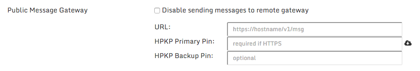

### 

### URL

The HTTP or HTTPS URL to the messaging endpoint must be specified.

**A value is REQUIRED if messaging is enabled. An HTTPS URL is strongly recommended for security purposes.**

The acceptable format is:

http\[s\]:// (DNS hostname or IP address) (: port) / (path)

The validation regular expression the format must meet:

/\^https{0,1}:\\/\\/\[-a-z0-9\_\\.\]+(:\\d+)?\\/\[-a-z0-9\\.\\/\]\*\$/i

**Considerations:**

-   An IP address is allowed, but a DNS hostname is preferred

-   URL query parameters (‘?’ followed by additional characters) are not allowed

-   A non-standard port value can be included

**URL path note:**

If you are using the AdditionSecurity Message Gateway, the gateway **EXPECTS** a path of “/v1/msg”. If you are using your own proprietary gateway implementation, you can use any path value.

**Example values:**

http://gateway.example.com/v1/msg

http://gateway.example.com:8080/

https://gw1.us-west-2.elasticbeanstalk.com/v1/msg

### 

### HPKP Primary Pin

### 

A HTTP Public Key Pin (HPKP), also known as an SSL/TLS pin, for an HTTPS messaging URL. The Subject Public Key Info (SPKI) of the SSL/TLS certificate of an HTTPS website is hashed using SHA-256 and then Base64 encoded into a pin value.

The MobileAwareness product implements HPKP-compatible pin handling for verification of an HTTPS messaging endpoint certificate chain.

Background on HPKP and HPKP pin formats:

[*https://developer.mozilla.org/en-US/docs/Web/Security/Public\_Key\_Pinning*]

**A value is REQUIRED if messaging URL is HTTPS; the value is optional if messaging URL is HTTP**

The input value will be a 44-character string that represents the base64-encoded SHA-256 hash of a certificate in the HTTPS messaging endpoint certificate chain.

**Considerations:**

-   The pin for any certificate in the certificate chain is allowed

-   The certificate can be commercially issued, internally issued, or self-signed

-   The expiration and certificate usage attributes are ignored by MobileAwareness

-   The Mozilla reference document mentioned above includes command line suggestions to retrieve or generate an appropriate HPKP pin value from various certificate-related inputs

**Convenience note:**

The icon can be clicked/used to make a request to the previously specified URL and automatically populate the HPKP Primary Pin value with the appropriate leaf certificate pin value. The value will be marked in green if a pin was successfully downloaded; otherwise, an error message may be displayed or the URL will be indicated as invalid.

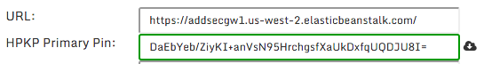

**Example values:**

M8HztCzM3elUxkcjR2S5/4hhyBNf6lHkmjAHKhpGPWE=\
cUPcTAZWKaASuYWhhneDttWpY3oBAkE3h2+soZS7sWs=

### 

### HPKP Backup Pin

### 

Similar to the HPKP Primary Pin, a HPKP Backup Pin can be configured in case the gateway ceases to use the certificate associated with the primary pin, etc. Typical usage involves creating an emergency self-signed backup certificate for the endpoint in question, and storing it offline; it is only deployed in the event an issue occurs with primary certificate, e.g. a security breech.

A value is OPTIONAL, and only relevant if messaging URL is HTTPS.

The input value will be a 44-character string that represents the base64-encoded SHA-256 hash of a certificate in the HTTPS messaging endpoint certificate chain. Please follow the configuration guidance of the HPKP Primary Pin.

**Considerations:**

-   Since the backup certificate is not intended to be actively deployed, it is necessary to manually calculate the HPKP pin value from the backup certificate and enter it here; a “Fetch from URL” option is not available for the backup pin

Stealth Callbacks
=================

Stealth callbacks are an optional security feature used by the MobileAwareness product to create a strong linkage between the MobileAwareness SDK and hosting application.

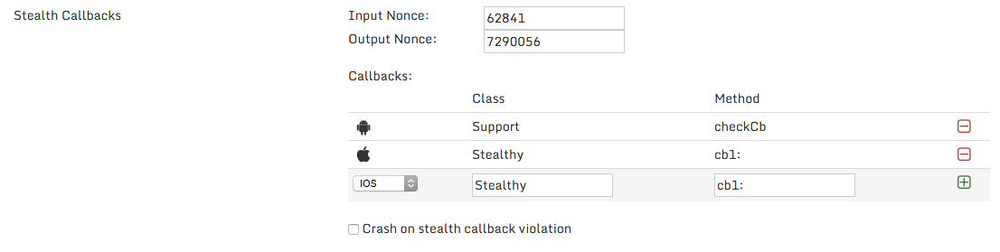

Detailed discussion of the operation of stealth callbacks is included in the MobileAwareness product documentation.

To disable stealth callbacks
----------------------------

Remove any listed callbacks by clicking on the  icon, so that no callbacks are listed in the table.

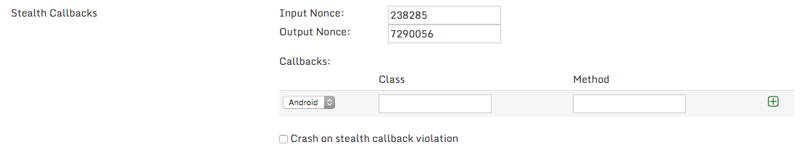

**Note:**

The value of “Input Nonce”, “Output Nonce”, and “Crash on stealth callback violation” are benign/non-effectual if no callbacks are in the list. Those values can be left as-is.

To enable stealth callbacks
---------------------------

Configure the following values.

### 

### Input Nonce & Output Nonce

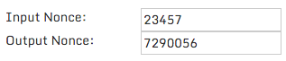

The stealth callback mechanism involves the SDK sending an input nonce to the application for verification, and the application returning an output nonce back to the SDK for verification.

**A value is REQUIRED to be present, even if no stealth callbacks are listed.**

The input nonce is a 1-8 digit number in the range of 0 &lt; 16777216 (i.e. a 24-bit number).

**Note:**

A random appropriate value is generated and included for your first configuration.

**Considerations:**

-   The value can be changed at any time, but must stay synchronized with the value expected (input) or returned (output) by the application stealth callback implementation; see the MobileAwareness product guide for details on stealth callback implementation

**Example values:**

42

7290056

### 

### Callbacks list

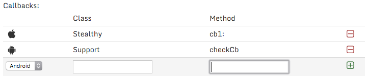

The Callbacks list shows platform-specific source code class and method names. The MobileAwareness product will use dynamic class & method resolution (e.g. reflection, etc.) to locate the listed class, and invoke the listed method, sending the configured input nonce and expecting the configured output nonce in return. Please see the MobileAwareness product guide for details on stealth callback operation.

**Considerations:**

-   Stealth callbacks are configured on a per-platform basis

-   If a platform has no listed stealth callbacks, then the stealth callback feature is disabled on that platform

-   Only two callbacks are utilized for a single platform; if more than two callbacks are listed for a single platform, then two of the callbacks will be chosen at random for use

-   The values of the callbacks must match valid names used within the hosting application, and must stay in sync

-   There is no way to verify the correct configured values prior to application runtime, so be sure to test your application and stealth callback operation in a development build before shipping

#### Adding an IOS stealth callback

On IOS platform, the “Class” is an Objective-C class name, and the “Method” is an Objective-C class method selector including parameters.

Class names and method selectors can only contain the following characters:

A-Z a-z 0-9 - \_ . :

The validation regular expression the value must meet:

/\^\[-a-z0-9\_\\.:\]+\$/i

On the bottom of the table, select “IOS” from the drop down menu, then type in the Objective-C class name and Objective-C class method selector values.

For example, for a class name “Stealthy” and a class method selector of “cb:”, you would type the following values:

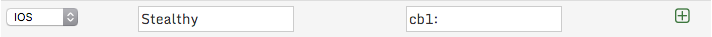

Click the  icon to add the callback definition to the list. It will appear with an Apple logo to indicate it is an IOS configured callback.

#### 

#### Adding an Android stealth callback

On Android platform, the “Class” is a Java class name, and the “Method” is a static class method name.

Class names and method names can only contain the following characters:

A-Z a-z 0-9 - \_ .

The validation regular expression the value must meet:

/\^\[-a-z0-9\_\\.\]+\$/i

On the bottom of the table, select “Android” from the drop down menu, then type in the Java class name and Java method name values.

For example, for a class name “Support” and a method name “checkCb”, you would type the following values:

Click the 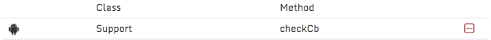 icon to add the callback definition to the list. It will appear with an Android logo to indicate it is an Android configured callback.

#### Removing an existing callback

Click the  icon on the row of the callback you wish to remove.

### Crash on stealth callback violation

An optional configuration item that causes the MobileAwareness product to immediately crash/abort the application if the operation of the stealth callbacks fail. See the MobileAwareness product documentation regarding the operation of stealth callbacks.

#### To enable crashing on stealth callback violation

Check the indicated checkbox.

#### To disable crashing on stealth callback violation

Uncheck the indicated checkbox.

Misc Options
============

The MobileAwareness product offers multiple optional behavior modification selections.

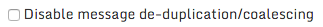

Disable message de-duplication/coalescing
-----------------------------------------

The MobileAwareness engine embedded into the application uses an analytics engine to remove duplicate or similar messages that represent the same general observation. This results in less redundant messages sent to the application (via callbacks) and sent to a remote message gateway.

Message de-duplication/coalescing is enabled by default. Check the box if you wish to disable this feature.

Disable error reports to AdditionSecurity
-----------------------------------------

The MobileAwareness engine may send bug/internal operational error notices to an AdditionSecurity API endpoint for internal bug tracking & fixing purposes. See the MobileAwareness product documentation for the details of the information sent.

Error reporting is enabled by default. Check the box if you wish to disable this feature; **however, it may affect Customer Support troubleshooting by AdditionSecurity.**

Disable persistence of user identity
------------------------------------

The value given to the optional MobileAwareness AS\_Register\_Identity() API function is saved to the system and restored upon future application restarts without any further need to call AS\_Register\_Identity(). See the MobileAwareness product documentation for the details of the AS\_Register\_Identity() API call and the platform-specific manner in which it persists the value.

Saving and restoring this identity value is enabled by default. In some circumstances, it may be desirable to not save the value to a persistent storage. Check the box if you wish to disable this feature.

Save & Generate Configuration
=============================

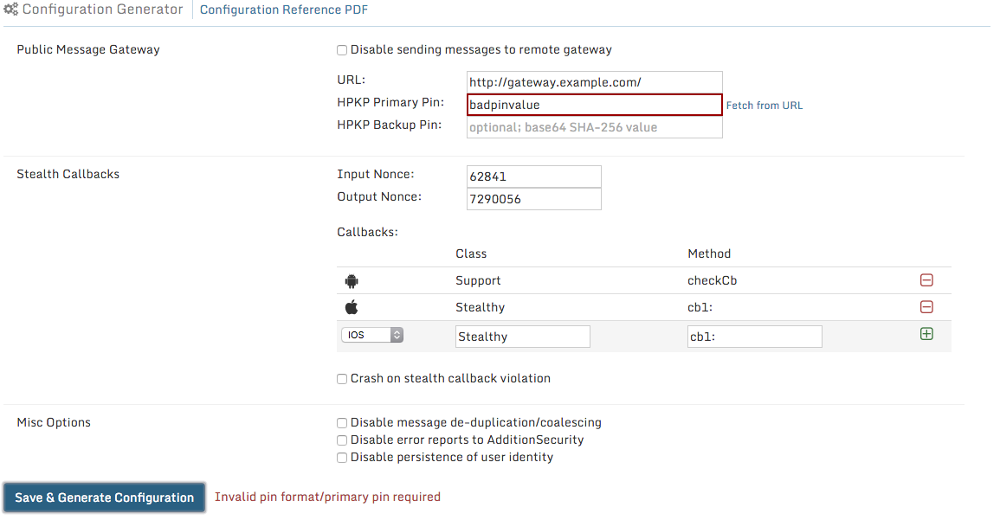

Once you have appropriately entered in your configuration options, click the “Save & Generate Configuration” button. If there is an error in an item, an error message will be displayed along with the invalid field indicated and the configuration will **NOT** be saved.

Otherwise, the configuration will be saved and a subsequent browser download of an “as.conf” file will start.

The downloaded “as.conf” file contains the specified configuration for all of your MobileAwareness licensed platforms, and is suitable for immediate inclusion into your product builds. See the MobileAwareness product documentation for further details regarding the “as.conf” file.

  [*Overview*]: #overview
  [*Public Messaging Gateway*]: #public-messaging-gateway
  [*To disable sending messages to a remote gateway*]: #to-disable-sending-messages-to-a-remote-gateway
  [*To enable sending messages to a remote gateway*]: #to-enable-sending-messages-to-a-remote-gateway
  [*URL*]: #url
  [*HPKP Primary Pin*]: #hpkp-primary-pin
  [*HPKP Backup Pin*]: #hpkp-backup-pin
  [*Stealth Callbacks*]: #stealth-callbacks
  [*To disable stealth callbacks*]: #to-disable-stealth-callbacks
  [*To enable stealth callbacks*]: #to-enable-stealth-callbacks
  [*Input Nonce & Output Nonce*]: #input-nonce-output-nonce
  [*Callbacks list*]: #callbacks-list
  [*Adding an IOS stealth callback*]: #adding-an-ios-stealth-callback
  [*Adding an Android stealth callback*]: #adding-an-android-stealth-callback
  [*Removing an existing callback*]: #removing-an-existing-callback
  [*Crash on stealth callback violation*]: #crash-on-stealth-callback-violation
  [*To enable crashing on stealth callback violation*]: #to-enable-crashing-on-stealth-callback-violation
  [*To disable crashing on stealth callback violation*]: #to-disable-crashing-on-stealth-callback-violation
  [*Misc Options*]: #misc-options
  [*Disable message de-duplication/coalescing*]: #disable-message-de-duplicationcoalescing
  [*Disable error reports to AdditionSecurity*]: #disable-error-reports-to-additionsecurity
  [*Disable persistence of user identity*]: #disable-persistence-of-user-identity
  [*Save & Generate Configuration*]: #save-generate-configuration
  []: media/image18.png{width="6.5in" height="4.125in"}
  [1]: media/image23.png{width="6.5in" height="0.3055555555555556in"}
  [2]: media/image19.png{width="6.5in" height="1.1111111111111112in"}
  [3]: media/image34.png{width="5.760416666666667in" height="0.3333333333333333in"}
  [4]: media/image33.png{width="5.791666666666667in" height="0.3645833333333333in"}
  [*https://developer.mozilla.org/en-US/docs/Web/Security/Public\_Key\_Pinning*]: https://developer.mozilla.org/en-US/docs/Web/Security/Public_Key_Pinning
  [5]: media/image41.png{width="0.21875in" height="0.1875in"}
  [6]: media/image40.png{width="4.203125546806649in" height="0.5552755905511811in"}
  [7]: media/image43.png{width="5.833333333333333in" height="0.3125in"}
  [8]: media/image42.png{width="6.5in" height="1.6388888888888888in"}
  [9]: media/image46.png{width="0.19791666666666666in" height="0.20833333333333334in"}
  [10]: media/image44.png{width="6.5in" height="1.3055555555555556in"}
  [11]: media/image45.png{width="3.3020833333333335in" height="0.7083333333333334in"}
  [12]: media/image47.png{width="6.5in" height="1.4027777777777777in"}
  [13]: media/image48.png{width="6.5in" height="0.3333333333333333in"}
  [14]: media/image49.png{width="0.1875in" height="0.19791666666666666in"}
  [15]: media/image50.png{width="6.5in" height="0.5416666666666666in"}
  [16]: media/image51.png{width="6.5in" height="0.3333333333333333in"}
  [17]: media/image52.png{width="0.1875in" height="0.19791666666666666in"}
  [18]: media/image53.png{width="6.5in" height="0.5416666666666666in"}
  [19]: media/image54.png{width="0.1875in" height="0.1875in"}
  [20]: media/image10.png{width="6.5in" height="0.3055555555555556in"}
  [21]: media/image11.png{width="6.5in" height="0.4861111111111111in"}
  [22]: media/image12.png{width="3.3645833333333335in" height="0.28125in"}
  [23]: media/image13.png{width="3.21875in" height="0.22916666666666666in"}
  [24]: media/image14.png{width="2.8645833333333335in" height="0.19791666666666666in"}
  [25]: media/image15.png{width="2.6354166666666665in" height="0.5in"}
  [26]: media/image16.png{width="6.5in" height="3.388888888888889in"}
  [27]: media/image17.png{width="4.302083333333333in" height="0.5833333333333334in"}
