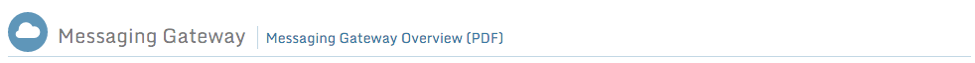
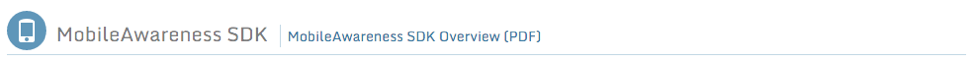

Welcome!
========

This guide overviews the usage of the AdditionSecurity customer portal web site.

The purpose of the portal is to provide you full access to all licensed AdditionSecurity materials including:

-   Product executable and SDK downloads

-   Product documentation

-   Deployment & integration documentation

-   Quickstart guides

-   Updated product data files

-   Direct method to contact Customer Support

Messaging Gateway
=================

The Messaging Gateway product section includes all necessary components to deploy and configure a remote network messaging gateway for use with the MobileAwareness product. Use of the Messaging Gateway is optional.

Further included are various guides to integrating the Messaging Gateway with Security Information and Event Management (SIEM) and analytics systems.

We recommend reviewing the Messaging Gateway Overview document to familiarize yourself with the role the Messaging Gateway plays. When you are ready to deploy a Messaging Gateway, download the software from the Downloads section, and consult the Operations Guide. You can follow a guided deployment utilizing one of the provided QuickStart guides.

MobileAwareness SDK
===================

The MobileAwareness product section includes downloadable SDKs and documentation needed to use the MobileAwareness SDK in your mobile applications.

Also included is the online Configuration Generator, which produces a downloadable configuration file that is required to be bundled with any application utilizing the MobileAwareness SDK.

We recommend reviewing the MobileAwareness SDK Overview document to familiarize yourself with the features of the MobileAwareness SDK. Once you are ready to develop with the MobileAwareness SDK, you should download the appropriate platform SDK (Android, IOS, etc.) from the Downloads section, and consult the related Developer Guide listed in the Documentation section.

You will also need to use the Configuration Generator to produce a configuration file. The MobileAwareness SDK Developer Guides will describe the configuration details necessary for your platform, and the online Configuration Reference PDF will guide you in populating the Configuration Generator inputs.

